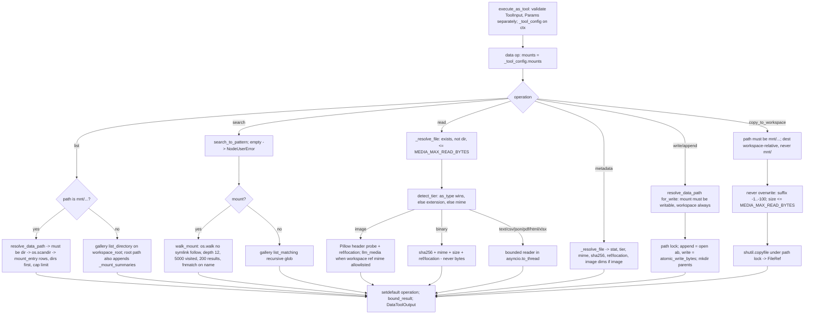

# Data (`dataSource`)

| Field | Value |
|------|-------|
| **Category** | tool / ai (palette group `tool`) |
| **Backend** | [`server/nodes/tool/data_source/__init__.py::DataSourceNode.data`](../../../server/nodes/tool/data_source/__init__.py) (dispatch via `execute_as_tool` -> `BaseNode.execute()` + `@Operation("data")`; plugin folder: [`_paths.py`](../../../server/nodes/tool/data_source/_paths.py) two-namespace resolution, [`_readers.py`](../../../server/nodes/tool/data_source/_readers.py) bounded typed readers, [`_handlers.py`](../../../server/nodes/tool/data_source/_handlers.py) Data-panel WS API; machine-wide allowlist in [`services/data/mount_store.py`](../../../server/services/data/mount_store.py)) |
| **WS handlers** | `data_list_mounts` / `data_add_mount` / `data_update_mount` / `data_remove_mount` / `data_browse` (self-registered via `register_ws_handlers`; `@ws_response`, external-socket + authenticated-owner checks, browse additionally requires a saved workflow that owns exactly one `dataSource` node with the given id) |
| **Tests** | [`server/tests/nodes/test_data_source_node.py`](../../../server/tests/nodes/test_data_source_node.py) (spec, ToolInput validation, path security, workspace tiers, mount flows, handler security); [`server/tests/services/data/test_mount_store.py`](../../../server/tests/services/data/test_mount_store.py) (mount validation matrix) |
| **Skill (if any)** | none |
| **Dual-purpose tool** | ToolNode - tool name `data` (`tool_schema_locked = True`, split schema: LLM sees `DataToolInput`, operator config `DataToolParams` is `server_controlled_fields = {mounts}`) |

## Purpose

An agent-facing raw-data reader/writer over two path namespaces: the
per-workflow workspace (`reports/q3.csv`) and operator-approved external
mounts (`mnt/<mount_name>/<rel>`). Reads dispatch to typed, bounded tiers
(text / csv / json / pdf / html / xlsx / image metadata / binary) so a 20 MB
spreadsheet cannot become a blown Temporal payload; binary content travels
as references, never bytes. Writes go to the workspace or to mounts whose
operator flipped the `writable` flag. There is deliberately **no delete** —
deletion stays a human action in the gallery panel. `copy_to_workspace`
imports a mount file as a real `FileRef`, which is the bridge to previews,
drags and the [`visionAnalyze`](./visionAnalyze.md) tool.

## Inputs (handles)

| Handle | Connection type | Required | Purpose |
|--------|-----------------|----------|---------|
| `output-tool` (source, top, label "Data") | tools | yes (only way to use it) | Connect to an agent's `input-tools`; the agent calls `data(...)` |

No `input-main`. uiHints: `isToolPanel`, `isDataPanel` (renders
`client/src/components/parameterPanel/DataPanel.tsx`), `hideInputSection`,
`hideOutputSection`, `hideRunButton`; `isConfigNode` auto-derived from the
`tool` group. A framework-side execution with only `Params` (no tool args)
is treated as a harmless root `list`.

## Parameters

Operator config, `DataToolParams` (`extra="ignore"`; persisted via the Data
panel, never exposed to the model):

| Name | Type | Default | Required | displayOptions.show | Description |
|------|------|---------|----------|---------------------|-------------|
| `mounts` | string[] (title "Enabled Mounts") | `[]` | no | - | Names of machine-wide mounts this node exposes. A `""` or JSON-string value is coerced (`""`/`None` -> `[]`, JSON array string -> list, other string -> `[string]`) |

LLM-visible arguments, `DataToolInput` (`extra="forbid"`):

| Name | Type | Default | Required | Description |
|------|------|---------|----------|-------------|
| `operation` | enum `list` \| `read` \| `search` \| `metadata` \| `write` \| `append` \| `copy_to_workspace` | - | yes | Operation |
| `path` | string, `max_length=4096` | `""` | required (non-empty) by `read`, `metadata`, `write`, `append`, `copy_to_workspace` | Workspace-relative path or `mnt/<mount_name>/<file>`; empty `list` = workspace root + enabled mounts |
| `pattern` | string \| null, `max_length=256` | `null` | required by `search` | Filename glob or bare term (a term without glob metacharacters becomes `*term*` via `search_to_pattern`) |
| `as_type` | enum `auto` \| `text` \| `csv` \| `json` \| `pdf` \| `html` \| `xlsx` \| `image` \| `binary` | `auto` | no | `read`: force a tier instead of extension detection |
| `offset` | integer, `ge=0` | `0` | no | `read`: rows/lines/pages to skip |
| `limit` | integer, `ge=1, le=500` | `100` | no | rows/lines/pages/entries cap (shared by `list`, `read`, `search`) |
| `sheet` | string \| null, `max_length=128` | `null` | no | `read` xlsx: sheet name (default: active sheet) |
| `encoding` | string \| null, `max_length=32` | `null` | no | `read`: force text encoding (else utf-8 -> utf-8-sig -> latin-1 with `encoding_guessed: true`) |
| `content` | string \| null, `max_length=200000` | `null` | required by `write`, `append` | UTF-8 text |
| `dest` | string \| null, `max_length=4096` | `null` | no | `copy_to_workspace` destination (default `imports/<filename>`) |

Per-operation required-field failures raise `ValueError("<op> requires
a, b")` at validation, returned to the model as
`{"error": "Invalid tool input/configuration: ...", "error_type": "ValidationError"}`.

## Outputs (handles)

| Handle | Shape | Description |
|--------|-------|-------------|
| (tool result) | object | `DataToolOutput` (`extra="allow"`), passed through `bound_result` (200,000-byte serialized ceiling) |

### Output payload (TypeScript shape)

```ts
type Common = {
  operation: string;
  source: 'workspace' | 'mount';
  path: string;            // canonical round-trippable virtual path
  mount?: string;          // mount name (mount source only)
  truncated?: boolean;     // set by any cap, including bound_result
};
type WorkspaceEntry = { /* gallery row */ name: string; path: string; is_dir: boolean; mime_type: string | null;
  size_bytes: number; modified_at: string | null; ref: FileRef | null; preview: string | null; url?: string | null };
type MountEntry = { location: string; mount: string; name: string; is_dir: boolean; mime_type: string | null;
  size_bytes: number; modified_at: number | null; writable: boolean };   // never a FileRef, never a host path

// list
Common & { entries: WorkspaceEntry[] | MountEntry[]; count: number;
  mounts?: Array<{ name: string; path: string; writable: boolean; available: boolean }> };  // root listing only
// search
Common & { pattern: string; entries: WorkspaceEntry[] | MountEntry[]; count: number };
// read (tier-dependent)
Common & (
  | { type: 'text';  text: string; lines_total: number; offset: number; limit: number; encoding: string; encoding_guessed: boolean }
  | { type: 'csv';   columns: string[]; rows: string[][]; rows_total: number; offset: number; delimiter: string; encoding: string; encoding_guessed: boolean; columns_truncated: boolean }
  | { type: 'json';  data: unknown; pruned_paths: string[]; encoding: string; encoding_guessed: boolean }
  | { type: 'pdf';   pages: Array<{ page: number; text: string; truncated: boolean }>; pages_total: number; offset: number }
  | { type: 'html';  title: string | null; text: string; lines_total: number; offset: number; encoding: string; encoding_guessed: boolean }
  | { type: 'xlsx';  sheet: string; sheets: string[]; columns: unknown[]; rows: unknown[][]; rows_total: number; offset: number; columns_truncated: boolean }
  | { type: 'image'; image: { width: number; height: number; format: string; mode: string }; ref?: FileRef; location?: string;
      llm_media?: [{ ref: FileRef; detail: 'auto' }] }   // workspace refs with png/jpeg/webp/gif mime only
  | { type: 'binary'; mime_type: string; size_bytes: number; sha256: string; ref?: FileRef; location?: string }
);
// metadata
Common & { type: string; name: string; mime_type: string; size_bytes: number; modified_at: string; sha256: string;
  ref?: FileRef; location?: string; image?: { width: number; height: number; format: string; mode: string } };
// write / append
Common & { bytes_written: number; created: boolean; appended: boolean };
// copy_to_workspace
{ operation: 'copy_to_workspace'; source: 'workspace'; path: string; copied_from: string; ref: FileRef };
```

## Logic Flow



## Decision Logic

- **Namespace resolution** (`resolve_data_path`): first segment `mnt` is reserved. A mount path needs a name (`NodeUserError` listing the enabled mounts), the name must be in the node's `mounts` subset AND still present in the `data_mounts` table for the owner (`owner_id` = `ctx.user_id` / `ctx.raw.user_id` / `"owner"`), otherwise `NodeUserError`. Containment: reads use `resolve_within`, mutations `resolve_entry_within` (parent proven, basename appended unresolved); both roots are symlink-safe; `ValueError` from the backend helpers is translated to `NodeUserError`.
- **Write gate**: mounts require `writable`; writing to a mount root or the workspace root is refused; a directory target is refused. The workspace is always writable.
- **Tier detection** (`detect_tier`): explicit `as_type` wins; `.csv/.tsv` -> csv, `.json` -> json, `.pdf` -> pdf, `.html/.htm/.xhtml` -> html, `.xlsx/.xlsm` -> xlsx, a fixed text-extension set -> text; then mime `image/*` -> image, `text/*` -> text; else binary.
- **Bounds** (`_readers.py`): text window 65,536 bytes; csv 500 rows / 100 cols / 2,000 chars per cell (delimiter sniffed from the first 16 KiB, `\t` fallback for `.tsv`); json source <= 5 MiB, depth 8 with `pruned_paths` (50 max); pdf 20 pages per call, 20,000 chars per page; xlsx 500 rows (`read_only`, `data_only`, `rows_total` from `max_row - 1`); mount search depth 12 / 5,000 visited / 200 results; `bound_result` halves `rows` / `pages` / `entries` / `matches` / `items` then trims `text` / `data` until the envelope is <= 200,000 bytes and sets `truncated`.
- **References**: workspace targets get `ref` (a serialized `FileRef`, always `kind: "file"` via `to_file_ref`); mount targets get `location` only — host paths never leave the server.
- **Vision opt-in**: an image-tier `read` of a workspace file whose mime is in `IMAGE_MIME_ALLOWLIST` (`png`, `jpeg`, `webp`, `gif`) adds `llm_media: [{ref, detail: "auto"}]`, which the agent loop turns into a ref-only image block; mount images must be `copy_to_workspace`d first.
- **Error paths**: every user-correctable failure is a `NodeUserError` (missing file, directory-vs-file confusion, oversize, read-only mount, revoked mount, invalid JSON, bad encoding, missing optional dependency with the install hint, unknown sheet, too many copies). `execute_as_tool` renders it as `{"error": ...}` for the model.

## Side Effects

- **Database reads**: `data_mounts` via `DataMountStore.list_mounts` / `get_mount` (root listing and every mount resolution).
- **Database writes**: none from the tool operation. The panel handlers write `data_mounts` rows (`add` validates: absolute, exists, directory, not a filesystem root, not the home dir, no overlap with `DATA_DIR` or a legacy `~/.machina`, readable, writable-if-flagged, unique name matching `^[a-z0-9][a-z0-9_-]{0,63}$`, unique root; `update` toggles only `writable`).
- **Broadcasts**: none.
- **External API calls**: none.
- **File I/O**: reads under the workspace or mount roots; `write`/`append` create parent directories, `write` is atomic (`atomic_write_bytes`), `append` opens in `ab`; `copy_to_workspace` copies bytes into the workspace; all mutations take the per-path lock from `nodes/filesystem/_backend`.
- **Subprocess**: none.

## External Dependencies

- **Credentials**: none.
- **Services**: `services.media.workspace` (`workspace_root`, `workspace_file_url`), `services.media.limits.MEDIA_MAX_READ_BYTES`, `nodes/filesystem/_backend` (`resolve_within`, `resolve_entry_within`, `atomic_write_bytes`, `get_path_lock`), `nodes/filesystem/gallery/_service` (`list_directory`, `list_matching`, `search_to_pattern`, `to_file_ref`), `services.data.mount_store`, `services.llm.media.IMAGE_MIME_ALLOWLIST`.
- **Python packages**: stdlib for text/csv/json/binary; `pypdf` (`docs` extra) for pdf; `beautifulsoup4` (`docs` extra) for html; `openpyxl` for xlsx; `Pillow` for image metadata. Each missing package surfaces as a `NodeUserError` with the install hint (html additionally suggests `as_type='text'`).
- **Environment variables**: none directly (`DATA_DIR` shapes the protected roots via `core.paths`).
- **Task queue**: `TaskQueue.DEFAULT`. Annotations: not destructive, not readonly, not open_world.

## Edge cases & known limits

- `limit` is one knob for three different things (listing entries, read rows/lines/pages, search results); a model paging a CSV with `limit=500` also caps its next listing at 500.
- `read` and `metadata` compute a full SHA-256 of binary files (up to 25 MiB) on every call.
- `list` on the workspace passes `limit` to the gallery's `list_directory`, which applies its own `WORKSPACE_LIST_LIMIT` cap in addition.
- Mount `search` matches the **file name** only (`fnmatch` on `name.lower()`), never the relative directory; workspace `search` uses the backend's recursive glob.
- Mount listings expose symlinked files (walks do not follow symlinked directories); reading one later still goes through `resolve_within`, which rejects escapes.
- `copy_to_workspace` suffixing stops after 100 attempts with a `NodeUserError`.
- `write` of an empty `content` is rejected by validation (required fields are checked with truthiness), so an agent cannot create an empty file.
- Windows backslashes are normalized to `/`; `_clean` also strips leading/trailing slashes, so `/mnt/x/f` and `mnt/x/f` are the same path.
- Mount availability is re-checked on every call: a mount removed in the panel fails immediately even if a stale node still lists it (`available: false` in the root listing).
- No delete, no rename, no move — by design.

## Related

- **Skills using this as a tool**: none (the `tool_description` carries the usage contract).
- **Other nodes that consume this output**: [`visionAnalyze`](./visionAnalyze.md) (takes workspace-relative image paths discovered here), [`canvas`](./canvas.md) (displays `ref`s), `gallery` (human-side deletion).
- **Architecture docs**: [data_node.md](../../data_node.md), [media_transport.md](../../media_transport.md), [plugin_system.md](../../plugin_system.md).
