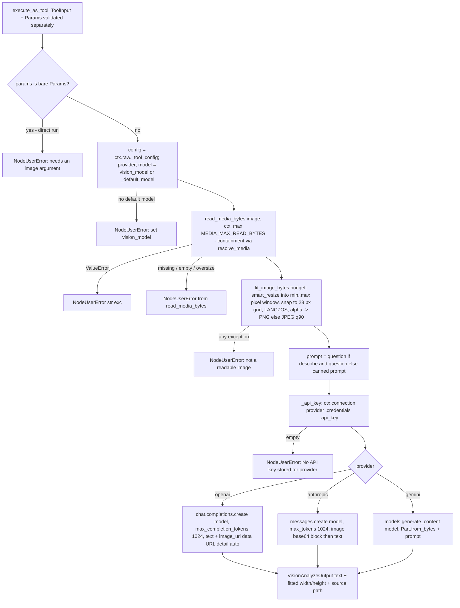

# Vision Analyze (`visionAnalyze`)

| Field | Value |
|------|-------|
| **Category** | tool / ai (palette group `tool`; plugin folder `nodes/vision/`) |
| **Backend** | [`server/nodes/vision/vision_analyze/__init__.py::VisionAnalyzeNode.vision`](../../../server/nodes/vision/vision_analyze/__init__.py) (dispatch via `execute_as_tool` -> `BaseNode.execute()` + `@Operation("vision")`; budget fitting in [`services/media/image_fit.py`](../../../server/services/media/image_fit.py); contained read via [`services/media/workspace.py::read_media_bytes`](../../../server/services/media/workspace.py)) |
| **Tests** | [`server/tests/nodes/test_vision_analyze.py`](../../../server/tests/nodes/test_vision_analyze.py) (`TestSmartResize`, `TestFitImageBytes`, `TestSpecInvariants`, `TestProviderRequestShapes`, `TestSafety`) |
| **Skill (if any)** | none |
| **Dual-purpose tool** | ToolNode - tool name `vision` (`tool_schema_locked = True`, split schema: LLM sees `VisionAnalyzeToolInput`; `provider` and `vision_model` are `server_controlled_fields`) |

## Purpose

Gives every agent — including ones running text-only models — real image
understanding by delegating to a vision-capable model. The tool loads a
workspace image at the provider boundary (bytes exist only inside the call
and never enter results), fits it to a visual-token budget, sends it to the
operator-chosen provider with an official SDK request shape, and returns
text: `describe` (optionally steered by `question`) or `extract_text`
(OCR-style). This is deliberately the speech-node shape rather than a
`ChatUnifier` call, so it works regardless of the host agent's provider and
remains the fallback rung for text-only host models once native image
blocks land.

## Inputs (handles)

| Handle | Connection type | Required | Purpose |
|--------|-----------------|----------|---------|
| `output-tool` (source, top, label "Vision") | tools | yes | Connect to an agent's `input-tools`; the agent calls `vision(...)` |

No `input-main`. uiHints: `isToolPanel`, `hideInputSection`,
`hideOutputSection`, `hideRunButton`; `isConfigNode` auto-derived. A direct
execution (Params only, no tool args) raises `NodeUserError("The vision tool
needs an image argument; connect it to an agent's tools ...")`.

## Parameters

Operator config, `VisionAnalyzeParams` (`extra="ignore"`):

| Name | Type | Default | Required | displayOptions.show | Description |
|------|------|---------|----------|---------------------|-------------|
| `provider` | enum `openai` \| `anthropic` \| `gemini` | `openai` | no | - | Which vision-capable provider answers the delegate call |
| `vision_model` | string | `""` | no | - | Vision model id; empty uses the provider's `default_model` from `llm_defaults.json` (`NodeUserError` if none is configured). Deliberately NOT named `model`: with a sibling `provider` field `ParameterRenderer.tsx` would overwrite a field literally named `model` with the chat-model list |

LLM-visible arguments, `VisionAnalyzeToolInput` (`extra="forbid"`):

| Name | Type | Default | Required | Description |
|------|------|---------|----------|-------------|
| `operation` | enum `describe` \| `extract_text` | - | yes | Describe the image, or extract visible text |
| `image` | string, `min_length=1, max_length=4096` (whitespace-only rejected) | - | yes | Workspace-relative path (e.g. `imports/chart.png`); use the `data` tool to discover files |
| `question` | string \| null, `max_length=4000` | `null` | no | `describe` only: a specific question about the image (ignored by `extract_text`) |
| `budget` | enum `small` \| `normal` \| `large` | `normal` | no | Visual-token budget: 256 / 1024 / 2048 tokens -> `tokens x 28^2` pixels (200,704 / 802,816 / 1,605,632) |

## Outputs (handles)

| Handle | Shape | Description |
|--------|-------|-------------|
| (tool result) | object | `VisionAnalyzeOutput` (`extra="allow"`) |

### Output payload (TypeScript shape)

```ts
{
  operation: 'describe' | 'extract_text';
  provider: 'openai' | 'anthropic' | 'gemini';
  vision_model: string;                 // resolved model id
  text: string;                         // provider text ("" if the provider returned nothing)
  image: { width: number; height: number; source: string };   // fitted dimensions + the requested path; never bytes
}
```

## Logic Flow



## Decision Logic

- **Validation**: `image` must be non-blank; `question` is only consulted for `describe`; `extra="forbid"` rejects any unknown argument (`ValidationError` -> `{"error": "Invalid tool input/configuration: ..."}`).
- **Config precedence** (`_config`): `ctx.raw["_tool_config"]` (validated persisted Params from `execute_as_tool`) > a bare `Params` instance > defaults. Model arguments can never set `provider` / `vision_model`.
- **Model resolution**: `vision_model.strip()` or `get_provider_config(provider).default_model`; a provider without a configured default raises `NodeUserError`.
- **Fitting** (`image_fit.smart_resize`): one aspect-preserving scale into `[min_pixels, max_pixels]` (floor = the `small` budget, 200,704 px, so tiny images are scaled UP), both dimensions rounded to multiples of 28 (minimum 28); resize only when the target differs; alpha (`RGBA`/`LA`/`PA`/palette with transparency) keeps PNG, otherwise JPEG quality 90.
- **Error paths**: containment/`ValueError` from the media reader -> `NodeUserError`; not-an-image -> `NodeUserError`; missing credential row -> `Connection.credentials()` raises `PermissionError` (rendered by `BaseNode.execute()` as the annotated credential envelope), an empty stored key -> `NodeUserError`; provider SDK exceptions are **not** caught here — they propagate as genuine errors (full traceback), not as `LLMError` -> `NodeUserError` (this path bypasses `ChatUnifier`).

## Side Effects

- **Database writes**: none. Token usage is deliberately NOT recorded through the pricing service (same stance as the LLM-backed translate providers): this path bills provider tokens the LLM pricing layer has no per-call meter for.
- **Broadcasts**: none.
- **External API calls**: exactly one — OpenAI `POST /v1/chat/completions` (`AsyncOpenAI(api_key)`), Anthropic `messages.create` (`AsyncAnthropic(api_key)`), or Gemini `generate_content` (`genai.Client(api_key)`). The image is sent inline as base64 (data URL for OpenAI, `source.type = base64` for Anthropic, `Part.from_bytes` for Gemini); `detail` is set explicitly to `auto` for OpenAI because omitting it has caused order-of-magnitude token regressions elsewhere.
- **File I/O**: one contained read of the workspace image; nothing written.
- **Subprocess**: none.

## External Dependencies

- **Credentials**: the provider's stored API key resolved through `ctx.connection(<provider>)` -> `Credential.resolve` for the credential whose id equals the provider string (`OpenAICredential` / `AnthropicCredential` / `GeminiCredential` in `nodes/model/_credentials.py`). The node declares no `credentials` tuple of its own.
- **Services**: `services.media` (`read_media_bytes`, `resolve_media` containment, `MEDIA_MAX_READ_BYTES`), `services.media.image_fit`, `services.llm.config.get_provider_config`.
- **Python packages**: `Pillow`; `openai`, `anthropic`, `google-genai` (imported lazily per provider).
- **Task queue**: `TaskQueue.AI_HEAVY`. Annotations: `readonly`, `open_world` (image content leaves the machine).

## Edge cases & known limits

- Workspace-relative paths only: a `mnt/...` mount path from the `data` tool is not resolvable here — `copy_to_workspace` first.
- Output is capped at 1,024 tokens per call (`_MAX_OUTPUT_TOKENS`), not configurable.
- `budget` controls the pixel area sent, not the provider's own tiling: 28 px is the Anthropic patch edge used as a single default for every provider.
- `llm_defaults.json providers.<p>.vision.enabled` (the native-image-block gate) is irrelevant to this tool — it always sends the image, regardless of that flag.
- Gemini uses the plain `AIza` API-key client only; Vertex/ADC project auth is not supported on this path.
- An empty provider response yields `text: ""` with `success: true` — no retry, no error.
- Every call re-reads and re-encodes the image; there is no cache across repeated questions about the same file.

## Related

- **Skills using this as a tool**: none.
- **Other nodes that consume this output**: none directly; pairs with [`dataSource`](./dataSource.md) (path discovery, `llm_media` opt-in for natively vision-capable hosts) and [`canvas`](./canvas.md) / browser screenshot FileRefs as inputs.
- **Architecture docs**: [data_node.md](../../data_node.md) (vision section + native image blocks), [media_transport.md](../../media_transport.md), [native_llm_sdk.md](../../native_llm_sdk.md).
