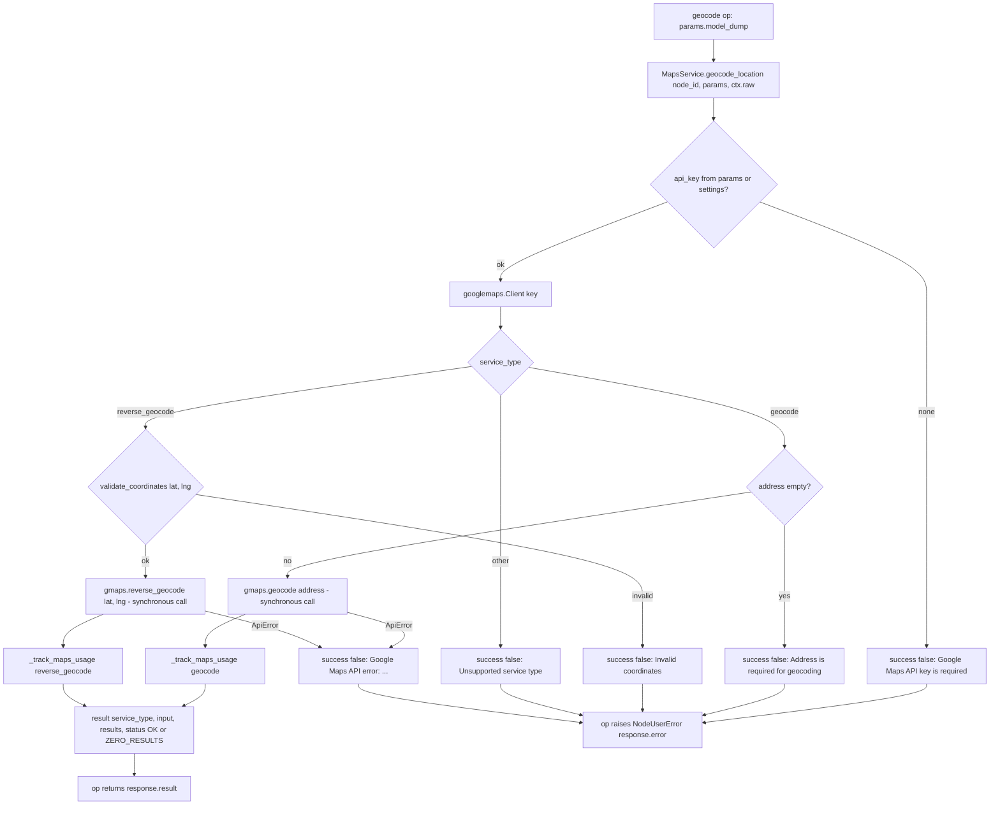

# Geocoding (`gmaps_locations`)

| Field | Value |
|------|-------|
| **Category** | chat_utility (grouping) / location (functional domain; palette groups `location`, `service`, `tool`) |
| **Backend handler** | [`server/nodes/location/gmaps_locations/__init__.py::GmapsLocationsNode.geocode`](../../../server/nodes/location/gmaps_locations/__init__.py) — dispatch via `BaseNode.execute()` + `@Operation("geocode")` -> [`server/nodes/location/_service.py::MapsService.geocode_location`](../../../server/nodes/location/_service.py) |
| **Tests** | none dedicated — spec-level coverage only: `TestPhase3dCoverage` in [`server/tests/test_node_spec.py`](../../../server/tests/test_node_spec.py), tool-name snapshot in [`server/tests/fixtures/tool_names_snapshot.json`](../../../server/tests/fixtures/tool_names_snapshot.json) |
| **Skill (if any)** | [`server/skills/travel_agent/geocoding-skill/SKILL.md`](../../../server/skills/travel_agent/geocoding-skill/SKILL.md) (`allowed-tools: "gmaps_locations"`) |
| **Dual-purpose tool** | yes - tool name `geocode` (`usable_as_tool = True`) |

## Purpose

Forward geocoding (address -> coordinates) and reverse geocoding
(coordinates -> address) through the Google Maps Geocoding API via the
`googlemaps` client. Used as a workflow node or, more commonly, as the
`geocode` tool on a travel/consumer agent. Each call tracks a `geocode` or
`reverse_geocode` usage row at $0.005 (from `pricing.json`).

## Inputs (handles)

| Handle | Connection type | Required | Purpose |
|--------|-----------------|----------|---------|
| `input-main` | main | no | Upstream address / coordinates via templates |
| `output-tool` (source, synthesized) | tools | no | `usable_as_tool = True` with neither hide flag declared: the base class marks `input-main` / `output-main` hidden on the canvas and `_metadata_dict` appends an `output-tool` handle for agent wiring |

## Parameters

Params model `GmapsLocationsParams` (`extra="ignore"`):

| Name | Type | Default | Required | displayOptions.show | Description |
|------|------|---------|----------|---------------------|-------------|
| `service_type` | enum `geocode` \| `reverse_geocode` | `geocode` | no | - | `geocode`: address -> lat/lng; `reverse_geocode`: lat/lng -> address |
| `address` | string | `""` | required by `geocode` (service raises "Address is required for geocoding") | `service_type: [geocode]` | Street address or place name |
| `region` | string | `""` | no | `service_type: [geocode]` | ISO country code bias — **never read by the service** (see Edge cases) |
| `lat` | number | `0.0` | no | `service_type: [reverse_geocode]` | Latitude (-90..90, validated by the service) |
| `lng` | number | `0.0` | no | `service_type: [reverse_geocode]` | Longitude (-180..180) |

The API key is not a Param. `node_executor._inject_api_keys` adds `api_key`
to the raw params for `GOOGLE_MAPS_TYPES` (stored `google_maps` credential,
else `settings.google_maps_api_key`), but `extra="ignore"` drops it from
`params.model_dump()`, so `MapsService.geocode_location` sees no `api_key`
and falls back to `settings.google_maps_api_key` (env
`GOOGLE_MAPS_API_KEY`). `GoogleMapsCredential` (`google_maps`) is declared on
the node for credential-modal visibility and key validation.

## Outputs (handles)

| Handle | Shape | Description |
|--------|-------|-------------|
| `output-main` | object | The service's `result` dict. `GmapsLocationsOutput` declares `latitude` / `longitude` / `formatted_address` / `place_id`, but the op returns the raw service payload; with `extra="allow"` + `exclude_unset` serialization the declared fields are simply absent |

### Output payload (TypeScript shape)

```ts
{
  service_type: 'geocoding' | 'reverse_geocoding';
  input: { address: string } | { lat: number; lng: number };
  results: Array<GoogleGeocodingResult>;   // raw googlemaps client rows: formatted_address, geometry.location, place_id, address_components, ...
  status: 'OK' | 'ZERO_RESULTS';
}
```

## Logic Flow



## Decision Logic

- **Validation** (inside the service): API key present; `address` non-empty for `geocode`; `validate_coordinates` for `reverse_geocode`; unknown `service_type` (unreachable through the Literal) -> error.
- **Branches**: `geocode` vs `reverse_geocode`; `status` is `OK` when the client returned rows, `ZERO_RESULTS` otherwise (still `success: true`).
- **Fallbacks**: `lat` / `lng` default to `0` inside the service when missing.
- **Error paths**: the service returns `{success: false, error}` for `googlemaps.exceptions.ApiError` (prefixed "Google Maps API error: ") and any other exception; the op raises `NodeUserError(error or "Geocoding failed")` so the framework emits one WARN line and the structured error envelope (as a tool: `{"error": ...}`).

## Side Effects

- **Database writes**: one `api_usage_metrics` row per successful call via `_track_maps_usage` (`service: google_maps`, `operation`/`endpoint: geocode` or `reverse_geocode`, `resource_count: 1`, cost from `PricingService.calculate_api_cost` — $0.005 each per `pricing.json`), keyed by `ctx.raw.workflow_id` / `session_id`. The `cost=` on `@Operation` is inert metadata.
- **Broadcasts**: none.
- **External API calls**: Google Geocoding API through `googlemaps.Client` (key as query param).
- **File I/O / Subprocess**: none.

## External Dependencies

- **Credentials**: `GoogleMapsCredential` (`google_maps`, `key_location = "query"`, probe = geocoding a sentinel address); at execution time the service effectively needs `settings.google_maps_api_key` (see Edge cases).
- **Services**: `MapsService` via `services.plugin.deps.get_maps_service()`, `PricingService`.
- **Python packages**: `googlemaps`.
- **Environment variables**: `GOOGLE_MAPS_API_KEY` (the fallback that is, in practice, the only key the service uses).
- **Task queue**: `TaskQueue.REST_API`. Annotations: `readonly`, `open_world`.

## Edge cases & known limits

- **Stored credential vs env key**: the injected `api_key` is stripped by `extra="ignore"` before `params.model_dump()` reaches the service, so a key saved in the Credentials modal is not what executes — only `GOOGLE_MAPS_API_KEY` works. (Documented, not fixed here; same wiring as `gmaps_create`.)
- `region` is a dead parameter: the service never passes it to `gmaps.geocode`.
- The `googlemaps` client is synchronous; `gmaps.geocode` / `gmaps.reverse_geocode` block the event loop for the duration of the HTTP call (no `to_thread`).
- `results` is the untrimmed Google payload — several KB per row — and it is persisted, broadcast and (as a tool) replayed into the LLM context.
- Usage is charged even for `ZERO_RESULTS`.
- The declared `Output` fields (`latitude`, `longitude`, `formatted_address`, `place_id`) never appear; consumers must read `results[0].geometry.location` / `results[0].formatted_address` themselves.
- The skill doc still calls the node "Add Locations" with an `add_locations` tool; the registered display name is "Geocoding" and the tool name is `geocode`. Its argument table (`service_type`, `address`, `lat`, `lng`) does match the Params.

## Related

- **Skills using this as a tool**: [`geocoding-skill`](../../../server/skills/travel_agent/geocoding-skill/SKILL.md).
- **Other nodes that consume this output**: [`gmaps_nearby_places`](./gmaps_nearby_places.md) (coordinates), [`gmaps_create`](./gmaps_create.md) (map centre).
- **Architecture docs**: [pricing_service.md](../../pricing_service.md), [plugin_system.md](../../plugin_system.md).
