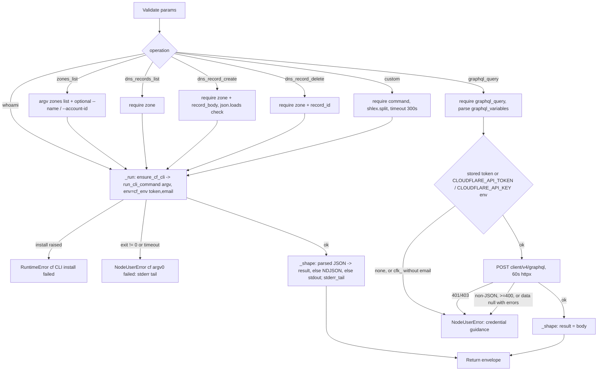

# Cloudflare (`cloudflareAction`)

| Field | Value |
|------|-------|
| **Category** | deployment (palette group `deployment`; class `group = ("deployment", "tool")`) |
| **Backend handler** | [`server/nodes/cloudflare/cloudflare_action.py`](../../../server/nodes/cloudflare/cloudflare_action.py) (`CloudflareActionNode`, on `ActionNode`); env / credential routing in [`_service.py`](../../../server/nodes/cloudflare/_service.py); installer [`_install.py`](../../../server/nodes/cloudflare/_install.py); login WS handlers [`_handlers.py`](../../../server/nodes/cloudflare/_handlers.py) |
| **Tests** | [`server/tests/test_cloudflare_plugin.py`](../../../server/tests/test_cloudflare_plugin.py) |
| **Skill (if any)** | [`server/skills/cloudflare/cloudflare-skill/SKILL.md`](../../../server/skills/cloudflare/cloudflare-skill/SKILL.md) (`allowed-tools: "cloudflare"`) |
| **Dual-purpose tool** | yes - tool name `cloudflare` |

## Purpose

Drive Cloudflare through the official `cf` CLI (npm `cf@0.2.0`, a technical
preview) from a workflow or from an agent. Six typed operations cover auth
identity, zone listing and DNS record CRUD, one operation posts directly to
the GraphQL Analytics API (the only channel to zone traffic / RUM analytics,
which the cf OAuth grant cannot reach), and `custom` passes any `cf ...`
command through verbatim. The CLI owns its own auth: the node performs no
credential pre-flight and never injects a token into argv.

## Inputs (handles)

| Handle | Connection type | Required | Purpose |
|--------|-----------------|----------|---------|
| `input-main` | main | no | Declared, but `hideInputHandle` is auto-set (`usable_as_tool = True` and the class does not declare `hide_input_handle`) - the node is normally reached through `output-tool` |

## Parameters

`extra="ignore"` on the model. `record_body` and `graphql_variables` have a
`mode="before"` validator that `json.dumps` a dict / list (LLM tool calls pass
real objects; the CLI flag and HTTP body want a string).

| Name | Type | Default | Required | displayOptions.show | Description |
|------|------|---------|----------|---------------------|-------------|
| `operation` | `whoami \| zones_list \| dns_records_list \| dns_record_create \| dns_record_delete \| graphql_query \| custom` | `whoami` | no | - | Operation dispatch key |
| `zone` | string | `""` | yes* | `operation` in `dns_records_list`, `dns_record_create`, `dns_record_delete` | Zone ID or domain name; becomes the global `--zone` flag. Empty raises `NodeUserError` on any DNS op |
| `name_filter` | string | `""` | no | `operation=zones_list` | `--name <f>` when non-blank |
| `account_id` | string | `""` | no | `operation=zones_list` | `--account-id <id>` when non-blank |
| `record_body` | string (JSON) | `""` | yes* | `operation=dns_record_create` | Raw JSON request body passed as `--body`; validated with `json.loads` first |
| `record_id` | string | `""` | yes* | `operation=dns_record_delete` | Positional record id for `dns records delete` |
| `graphql_query` | string | `""` | yes* | `operation=graphql_query` | GraphQL Analytics API query text |
| `graphql_variables` | string (JSON object) | `""` | no | `operation=graphql_query` | Parsed with `json.loads`; invalid JSON raises `NodeUserError` |
| `command` | string | `""` | yes* | `operation=custom` | Everything after `cf `, split with `shlex.split` |

## Outputs (handles)

| Handle | Shape | Description |
|--------|-------|-------------|
| `output-main` | object | `CloudflareActionOutput`; `hideOutputHandle` auto-set like the input |
| `output-tool` | - | Auto-appended for `usable_as_tool` |

### Output payload (TypeScript shape)

Keys are omitted when empty (`_shape` never writes `None`; `exclude_unset`
preserves that). `extra="allow"`.

```ts
{
  operation: string;
  success: true;            // failures raise instead of returning
  url?: string;             // custom only: stdout that is one line starting with "http"
  result?: unknown;         // parsed JSON stdout (or NDJSON recovered as an array), or the GraphQL body
  stdout?: string;          // raw stdout ONLY when nothing parsed as JSON
  stderr_tail?: string;     // last 2000 chars of stderr, present even on success (cf status noise)
}
```

## Logic Flow



## Decision Logic

- **Validation** (all `NodeUserError`): blank `zone` on any DNS op; blank
  `record_body` or `record_body` that is not JSON; blank `record_id`; blank
  `graphql_query`; `graphql_variables` that is not JSON; blank `command`.
- **No auth pre-flight**: `_run` never checks whether cf is logged in. cf's
  own "Not logged in" text arrives on stderr and is surfaced by the failure
  wrap.
- **Credential routing for CLI ops** (`cf_env`): a stored key starting with
  `cfk_` plus a stored email becomes the `CLOUDFLARE_API_KEY` +
  `CLOUDFLARE_EMAIL` pair and the ambient `CLOUDFLARE_API_TOKEN` /
  `CF_API_TOKEN` are popped (cf ranks tokens above the key pair); any other
  stored key becomes `CLOUDFLARE_API_TOKEN`; a `cfk_` key without an email
  injects nothing and cf falls back to its own OAuth session. Ambient env
  vars are otherwise left in place for ops.
- **Credential routing for `graphql_query`** (`api_auth_headers`): key from
  the stored `cloudflare` row, else `CLOUDFLARE_API_TOKEN`, else
  `CLOUDFLARE_API_KEY` env; email from the stored `cloudflare_email` row,
  else `CLOUDFLARE_EMAIL`. `cfk_` + email sends `X-Auth-Email` /
  `X-Auth-Key`; any other key sends `Authorization: Bearer`; `cfk_` without
  email yields no headers and the op fails before any request.
- **GraphQL response**: HTTP 401/403 -> `NodeUserError` naming the required
  token permission; non-JSON body -> `NodeUserError`; status >= 400 or
  (`data` is null and `errors` present) -> `NodeUserError` with the first
  error's `message`; otherwise the whole body (including partial `errors`)
  is returned as `result`.
- **Output shaping** (`_shape`): `run_cli_command` already ran a single
  `json.loads` on stdout; when that is `None` and stdout has two or more
  non-blank lines, every line is parsed as JSON (`_parse_ndjson`) - one
  failure abandons the attempt and stdout ships as text. `url` is set only by
  `custom`, and only when stdout is a single line starting with `http`.
- **Timeouts**: 120 s for the typed CLI ops, 300 s for `custom`, 60 s for the
  GraphQL POST. `run_cli_command` kills the process tree on timeout and
  returns `success: False` with `error: "<binary> timed out (Ns)"`, which the
  failure wrap turns into a `NodeUserError`.
- **Error paths**: `ensure_cf_cli()` raising (npm missing, npm install
  failing) -> `RuntimeError("cf CLI install failed: ...")`, which is NOT a
  `NodeUserError` and therefore takes `BaseNode.execute`'s generic exception
  branch (full traceback). Non-zero exit -> `NodeUserError("cf <argv0>
  failed: <last 2000 chars of stderr>")`, falling back to the envelope
  `error` when stderr is empty.

## Side Effects

- **Subprocess**: one `cf` process per operation from the project-local
  shim `<DATA_DIR>/packages/node_modules/.bin/cf` (`cf.cmd` on Windows).
  The system-global `cf` is never consulted. Child env is a copy of the
  server env plus `NO_COLOR=1` and the credential vars above; no `cwd` is
  passed (the process inherits the server's cwd - the workflow workspace is
  not used).
- **Install**: on first use `npm install cf@0.2.0 --prefix <DATA_DIR>/packages
  --no-audit --no-fund` runs in a worker thread under an install lock.
- **External API calls**: `POST https://api.cloudflare.com/client/v4/graphql`
  with `{query, variables}` (`graphql_query` only).
- **Credential reads**: `auth_service.get_api_key("cloudflare")` and
  `get_api_key("cloudflare_email")` on every `_run` and every GraphQL call.
- **Cost metadata**: every operation declares
  `cost={"service": "cloudflare", "action": "<operation>", "count": 1}`.
- **Broadcasts**: standard node status via `BaseNode.execute`; nothing
  plugin-specific. (Login / logout / status broadcasts belong to the WS
  handlers `cloudflare_login` / `cloudflare_logout` / `cloudflare_status`,
  not to this node.)
- **Database writes**: none by the node.

## External Dependencies

- **Credentials**: `CloudflareCredential` (`id = "cloudflare"`,
  `auth = "custom"`). `resolve()` returns the optional
  `cloudflare_api_token` (stored under the provider id `cloudflare`; an API
  token or a `cfk_` Global API Key) and `cloudflare_email`. The cf OAuth
  session created by `cf auth login` lives in cf's own user-level config and
  is never read by OpenCompany; the modal badge is a synthetic `cli-managed`
  marker OAuth row written by `_handlers.py`.
- **Services**: the `cf` CLI (Node >= 22, `npm` on PATH for the install);
  Cloudflare's dashboard OAuth for login (cf opens the browser itself and
  listens on a fixed loopback port it owns - see `_handlers.py` for the
  single-flight guard and the never-kill rule).
- **Python packages**: `httpx`, `pydantic`; `services.events.run_cli_command`.
- **Environment variables**: `CLOUDFLARE_API_TOKEN`, `CF_API_TOKEN`,
  `CLOUDFLARE_API_KEY`, `CF_API_KEY`, `CLOUDFLARE_EMAIL`, `CF_EMAIL`
  (ambient values honoured for ops, stripped for login / whoami / logout),
  `NO_COLOR`.

## Edge cases & known limits

- `annotations` declare `destructive: False` although `dns_record_delete`
  deletes records (gcloud, by contrast, declares `destructive: True`).
- `ui_hints = {"outputMode": "terminal"}`: text output renders
  preformatted; JSON `result` renders as a tree.
- `stderr_tail` is populated on success too, because cf prints status noise
  on stderr.
- `custom` can run any cf subcommand including `auth login` / `auth logout`;
  those run with `cf_env`, not `login_env`, so ambient credential vars are
  NOT stripped there (only the WS login handlers strip them).
- The GraphQL op ignores the cf OAuth session entirely: the fixed 86-scope
  grant has no analytics scope, so only a stored / ambient token or Global
  API Key can satisfy it.
- `whoami` under an ambient `CLOUDFLARE_API_TOKEN` reports the env token,
  not the OAuth session (that is why the WS status handler uses `login_env`).
- Argv shapes are verified only against the pinned `cf@0.2.0`; the preview
  CLI's surface drifts between versions.

## Related

- **Skills using this as a tool**: [cloudflare-skill](../../../server/skills/cloudflare/cloudflare-skill/SKILL.md)
- **Siblings**: [`gcloudAction`](./gcloudAction.md), [`vercelAction`](./vercelAction.md), [`githubAction`](./githubAction.md) - the same CLI-managed-auth pattern
- **Architecture docs**: [Cloudflare Service](../../cloudflare_service.md), [Plugin System](../../plugin_system.md)
