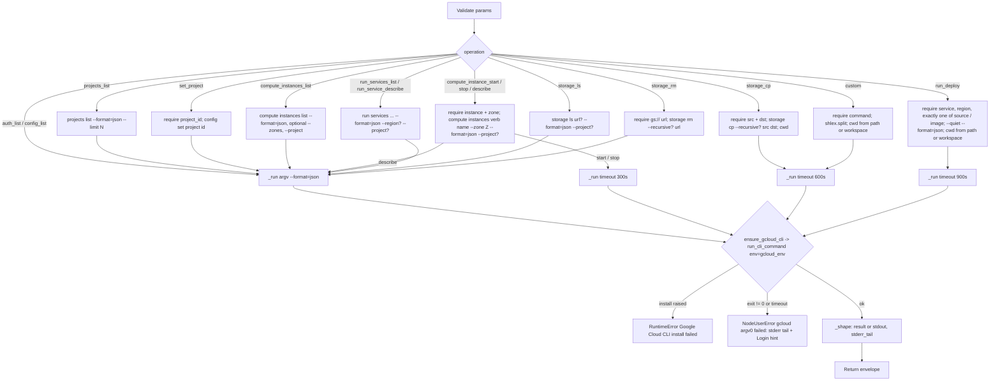

# Google Cloud (`gcloudAction`)

| Field | Value |
|------|-------|
| **Category** | deployment (palette group `deployment`; class `group = ("deployment", "tool")`) |
| **Backend handler** | [`server/nodes/gcloud/gcloud_action.py`](../../../server/nodes/gcloud/gcloud_action.py) (`GCloudActionNode`, on `ActionNode`); env + cwd helpers in [`_service.py`](../../../server/nodes/gcloud/_service.py); installer [`_install.py`](../../../server/nodes/gcloud/_install.py); login WS handlers [`_handlers.py`](../../../server/nodes/gcloud/_handlers.py) |
| **Tests** | [`server/tests/test_gcloud_plugin.py`](../../../server/tests/test_gcloud_plugin.py) |
| **Skill (if any)** | [`server/skills/gcloud/gcloud-skill/SKILL.md`](../../../server/skills/gcloud/gcloud-skill/SKILL.md) (`allowed-tools: "gcloud"`) |
| **Dual-purpose tool** | yes - tool name `gcloud` |

## Purpose

Run Google Cloud operations through a project-local, version-pinned
`gcloud` CLI: account / config snapshots, project selection, Compute Engine
instance list / start / stop / describe, Cloud Run deploy / list / describe,
Cloud Storage ls / cp / rm, and a `custom` passthrough for the rest of the
gcloud surface. Every invocation runs under an isolated `CLOUDSDK_CONFIG`
directory, so the node's login and project defaults never touch the
operator's own gcloud configuration.

## Inputs (handles)

| Handle | Connection type | Required | Purpose |
|--------|-----------------|----------|---------|
| `input-main` | main | no | Declared, but `hideInputHandle` is auto-set (`usable_as_tool = True`, class does not declare `hide_input_handle`) |

## Parameters

`extra="ignore"` on the model. `_PROJECT_OPS` = `projects_list`,
`compute_instances_list`, `compute_instance_start`, `compute_instance_stop`,
`compute_instance_describe`, `run_deploy`, `run_services_list`,
`run_service_describe`, `storage_ls`, `storage_cp`, `storage_rm`.

| Name | Type | Default | Required | displayOptions.show | Description |
|------|------|---------|----------|---------------------|-------------|
| `operation` | 15-value literal (see flow) | `config_list` | no | - | Operation dispatch key |
| `project` | string | `""` | no | `operation` in `_PROJECT_OPS` | `--project <id>` when set. Applied by the compute ops, the run ops and `storage_ls` only - NOT by `projects_list`, `storage_cp` or `storage_rm`, although the field is shown for them |
| `project_id` | string | `""` | yes* | `operation=set_project` | `config set project <id>` |
| `zone` | string | `""` | yes* for start / stop / describe | `operation` in the four `compute_*` ops | `--zone` (required) for instance ops; optional `--zones` filter for `compute_instances_list` |
| `instance` | string | `""` | yes* | `compute_instance_start`, `compute_instance_stop`, `compute_instance_describe` | Compute Engine instance name |
| `region` | string | `""` | yes* for deploy / describe | `run_deploy`, `run_service_describe`, `run_services_list` | `--region`; optional filter for `run_services_list` |
| `service` | string | `""` | yes* | `run_deploy`, `run_service_describe` | Cloud Run service name |
| `source` | string | `""` | one of source / image | `operation=run_deploy` | `--source <dir>`; mutually exclusive with `image` |
| `image` | string | `""` | one of source / image | `operation=run_deploy` | `--image <ref>` |
| `allow_unauthenticated` | bool | `false` | no | `operation=run_deploy` | Appends `--allow-unauthenticated` |
| `url` | string | `""` | yes* for rm | `storage_ls`, `storage_rm` | Positional `gs://` URL; `storage_rm` enforces the `gs://` prefix |
| `src` | string | `""` | yes* | `operation=storage_cp` | Copy source (local path or `gs://`) |
| `dst` | string | `""` | yes* | `operation=storage_cp` | Copy destination |
| `recursive` | bool | `false` | no | `storage_cp`, `storage_rm` | Appends `--recursive` |
| `limit` | int (1..500) | `50` | no | `operation=projects_list` | `--limit N` |
| `path` | string | `""` | no | `run_deploy`, `storage_cp`, `custom` | Working directory: absolute, or relative to the workflow workspace |
| `command` | string | `""` | yes* | `operation=custom` | Everything after `gcloud `, `shlex.split` |

## Outputs (handles)

| Handle | Shape | Description |
|--------|-------|-------------|
| `output-main` | object | `GCloudActionOutput`; `hideOutputHandle` auto-set |
| `output-tool` | - | Auto-appended for `usable_as_tool` |

### Output payload (TypeScript shape)

Keys omitted when empty; `extra="allow"`.

```ts
{
  operation: string;
  success: true;
  result?: unknown;       // parsed --format=json stdout
  stdout?: string;        // text stdout when nothing parsed (set_project, storage_cp, custom without --format)
  stderr_tail?: string;   // last 2000 chars of stderr (gcloud prints progress and warnings there)
}
```

## Logic Flow



## Decision Logic

- **Validation** (all `NodeUserError`): blank `project_id` (`set_project`);
  blank `instance` or blank `zone` (instance ops - `instance` is checked
  first); blank `service` or `region` (`run_deploy`,
  `run_service_describe`); `source` and `image` both set or both empty
  (`run_deploy`); blank `src` or `dst` (`storage_cp`); `url` not starting
  with `gs://` (`storage_rm`); blank `command` (`custom`).
- **Working directory** (`_cwd` -> `resolve_workdir`): with no `path`, no
  `required` flag and no workspace the cwd is `None` (inherit). An explicit
  relative `path` without a workspace, or a `path` that is not a directory,
  raises `NodeUserError`. `run_deploy` passes `required=bool(source)`, so a
  source deploy needs a workspace or a `path` while an image deploy does not.
  `storage_cp` and `custom` fall back to the workspace when one exists.
- **No auth pre-flight**: gcloud's own "You do not currently have an active
  account selected" surfaces through the failure wrap, which appends
  "(if this is an auth error, connect via Credentials -> Google Cloud ->
  Login)".
- **`--project` is appended only when `project` is non-blank**, and only by
  the ops that call `_project_flag` (compute ops, run ops, `storage_ls`).
- **Timeouts**: 120 s default; 300 s instance start / stop; 600 s
  `storage_cp` and `custom`; 900 s `run_deploy`. Timeout kills the process
  tree and becomes a `NodeUserError`.
- **Error paths**: install failure -> `RuntimeError` (generic exception
  branch, traceback); non-zero exit -> `NodeUserError` with the last 2000
  chars of stderr (or the envelope `error`).
- **Output shaping**: parsed JSON wins over stdout; both never ship together;
  `stderr_tail` present whenever stderr is non-empty.

## Side Effects

- **Subprocess**: one gcloud process per op from
  `<DATA_DIR>/packages/gcloud/<asset>.unzip|.untar/google-cloud-sdk/bin/gcloud`
  (`gcloud.cmd` on Windows). Env = server env plus
  `CLOUDSDK_CONFIG=<DATA_DIR>/gcloud/`, `CLOUDSDK_CORE_DISABLE_PROMPTS=1`,
  `CLOUDSDK_COMPONENT_MANAGER_DISABLE_UPDATE_CHECK=1`,
  `CLOUDSDK_CORE_DISABLE_USAGE_REPORTING=1`, `NO_COLOR=1`. Ambient
  `GOOGLE_APPLICATION_CREDENTIALS` / `CLOUDSDK_AUTH_ACCESS_TOKEN` /
  `CLOUDSDK_CORE_ACCOUNT` / `CLOUDSDK_CORE_PROJECT` / `GOOGLE_CLOUD_PROJECT`
  are NOT stripped for ops (only `login_env`, used by the WS handlers,
  strips them).
- **Install**: first use downloads the pinned `577.0.0` archive from
  `dl.google.com` via `pooch.retrieve` (no hash; 300 s per-read timeout) in a
  worker thread under a lock, extracts ~15k files under
  `package_dir("gcloud")`, and `chmod +x`es `bin/` on POSIX. Windows ARM64
  maps to the x86_64 bundled-python zip; darwin and linux-arm archives need a
  system `python3` (`CLOUDSDK_PYTHON` override).
- **File I/O**: `set_project` and any `custom` config command write into the
  pinned config dir; `storage_cp` writes local files relative to the cwd;
  `run_deploy --source` uploads the cwd.
- **Cost metadata**: every op declares
  `cost={"service": "gcloud", "action": "<operation>", "count": 1}`.
- **Broadcasts / DB writes**: none beyond the standard node status.

## External Dependencies

- **Credentials**: `GCloudCredential` (`id = "gcloud"`, `auth = "custom"`,
  `resolve()` returns `{}`) - a marker only; the node never reads it. The
  live session is gcloud's own credential store under the pinned config dir,
  minted by the `gcloud_login` WS handler (`gcloud auth login`, browser
  opened by the CLI on a random loopback port). Provider id `gcloud` is
  distinct from the Workspace `google` OAuth2 provider.
- **Services**: Google Cloud APIs reached by gcloud; `dl.google.com` for the
  install.
- **Python packages**: `pooch`, `pydantic`; `services.events.run_cli_command`.
- **Environment variables**: `CLOUDSDK_CONFIG` (always overridden),
  `CLOUDSDK_PYTHON` (non-bundled platforms), the automation vars listed above.

## Edge cases & known limits

- `annotations = {"destructive": True, ...}`: start / stop / deploy / rm
  mutate cloud state.
- A terminal `gcloud auth login` against the operator's global config is
  invisible to this node by design (config isolation).
- `custom` injects no `--format`, so table output lands in `stdout`; the
  600 s budget applies even to quick commands.
- `run_deploy` does not pass `path`-relative `source` through `resolve_workdir`;
  `--source <value>` is passed verbatim and gcloud resolves it against the
  cwd.
- Every op pays a fresh interpreter start (seconds on Windows), which the
  `tool_description` warns agents about.
- Cold install is roughly 60-110 MB download and far longer than the WS
  request budget; on the node path there is no `pending` fallback - the
  activity simply blocks until the install completes or fails.
- `ui_hints = {"outputMode": "terminal"}`.

## Related

- **Skills using this as a tool**: [gcloud-skill](../../../server/skills/gcloud/gcloud-skill/SKILL.md)
- **Siblings**: [`cloudflareAction`](./cloudflareAction.md), [`githubAction`](./githubAction.md), [`vercelAction`](./vercelAction.md)
- **Architecture docs**: [Google Cloud Service](../../gcloud_service.md)
