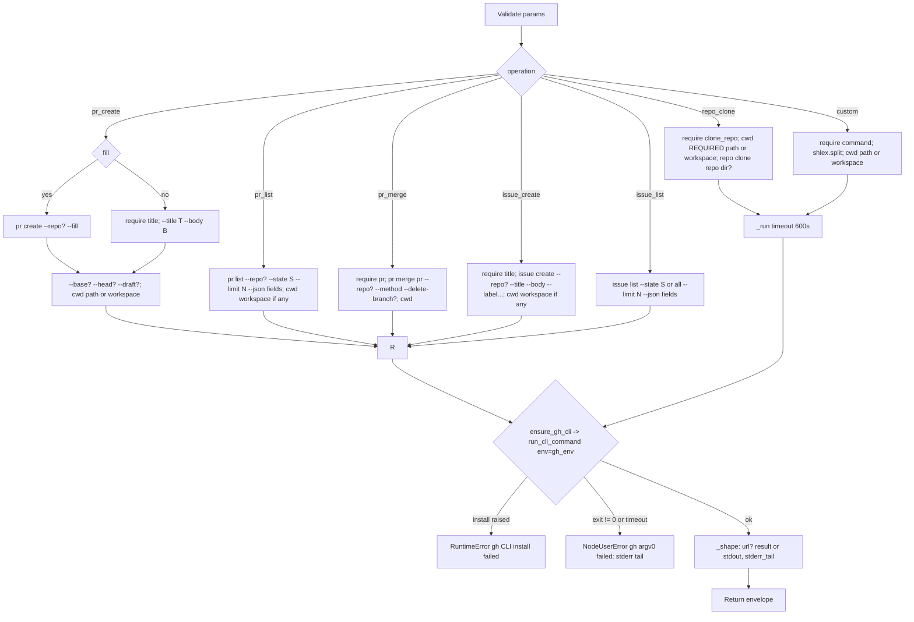

# GitHub (`githubAction`)

| Field | Value |
|------|-------|
| **Category** | vcs (palette group `vcs`; class `group = ("vcs", "tool")`) |
| **Backend handler** | [`server/nodes/github/github_action.py`](../../../server/nodes/github/github_action.py) (`GitHubActionNode`, on `ActionNode`); env + cwd helpers in [`_service.py`](../../../server/nodes/github/_service.py); installer [`_install.py`](../../../server/nodes/github/_install.py); login WS handlers [`_handlers.py`](../../../server/nodes/github/_handlers.py) |
| **Tests** | [`server/tests/test_github_plugin.py`](../../../server/tests/test_github_plugin.py) |
| **Skill (if any)** | [`server/skills/github/github-skill/SKILL.md`](../../../server/skills/github/github-skill/SKILL.md) (`allowed-tools: "github"`) |
| **Dual-purpose tool** | yes - tool name `github` |

## Purpose

Clone repositories, open / list / merge pull requests, create / list issues,
and run any other `gh` command, through a project-local pinned GitHub CLI.
List operations request `--json` so results land as parsed data; `gh`
authenticates from its own credential store (populated by `gh auth login`,
from the modal or a terminal) - the node performs no pre-flight and injects
no token.

## Inputs (handles)

| Handle | Connection type | Required | Purpose |
|--------|-----------------|----------|---------|
| `input-main` | main | no | Declared, but `hideInputHandle` is auto-set (`usable_as_tool = True`, class does not declare `hide_input_handle`) |

## Parameters

`extra="ignore"` on the model.

| Name | Type | Default | Required | displayOptions.show | Description |
|------|------|---------|----------|---------------------|-------------|
| `operation` | `repo_clone \| pr_create \| pr_list \| pr_merge \| issue_create \| issue_list \| custom` | `pr_list` | no | - | Operation dispatch key |
| `repo` | string | `""` | no | `pr_create`, `pr_list`, `pr_merge`, `issue_create`, `issue_list` | `--repo OWNER/REPO` when non-blank; otherwise gh infers from the cwd's git remote |
| `path` | string | `""` | no | `repo_clone`, `pr_create`, `pr_merge`, `custom` | Working directory: absolute or relative to the workflow workspace |
| `clone_repo` | string | `""` | yes* | `operation=repo_clone` | `OWNER/REPO` or full URL |
| `clone_dir` | string | `""` | no | `operation=repo_clone` | Optional target directory positional |
| `title` | string | `""` | yes* (unless `fill`) | `pr_create`, `issue_create` | `--title` |
| `body` | string | `""` | no | `pr_create`, `issue_create` | `--body`; passed even when empty |
| `base` | string | `""` | no | `operation=pr_create` | `--base` |
| `head` | string | `""` | no | `operation=pr_create` | `--head` |
| `draft` | bool | `false` | no | `operation=pr_create` | `--draft` |
| `fill` | bool | `false` | no | `operation=pr_create` | `--fill` instead of `--title` / `--body` |
| `state` | `open \| closed \| merged \| all` | `open` | no | `pr_list`, `issue_list` | `--state`; `merged` is coerced to `all` for issues |
| `limit` | int (1..100) | `30` | no | `pr_list`, `issue_list` | `--limit` |
| `pr` | string | `""` | yes* | `operation=pr_merge` | PR number, URL or branch positional |
| `merge_method` | `squash \| merge \| rebase` | `squash` | no | `operation=pr_merge` | Emitted as `--squash` / `--merge` / `--rebase` |
| `delete_branch` | bool | `false` | no | `operation=pr_merge` | `--delete-branch` |
| `labels` | string | `""` | no | `operation=issue_create` | Comma-separated; each becomes a `--label` |
| `command` | string | `""` | yes* | `operation=custom` | Everything after `gh `, `shlex.split` |

## Outputs (handles)

| Handle | Shape | Description |
|--------|-------|-------------|
| `output-main` | object | `GitHubActionOutput`; `hideOutputHandle` auto-set |
| `output-tool` | - | Auto-appended for `usable_as_tool` |

### Output payload (TypeScript shape)

Keys omitted when empty; `extra="allow"`.

```ts
{
  operation: string;
  success: true;
  url?: string;           // pr_create / issue_create: stdout starting with "http"; custom: single-line stdout starting with "http"
  result?: unknown;       // parsed JSON stdout (pr_list / issue_list --json, gh api via custom)
  stdout?: string;        // text stdout when nothing parsed
  stderr_tail?: string;   // last 2000 chars of stderr
}
```

`pr_list` JSON fields: `number,title,state,url,author,headRefName,baseRefName,createdAt`.
`issue_list` JSON fields: `number,title,state,url,author,labels,createdAt`.

## Logic Flow



## Decision Logic

- **Validation** (`NodeUserError`): blank `clone_repo`; blank `title` when
  `fill` is false (`pr_create`) or always (`issue_create`); blank `pr`; blank
  `command`.
- **Working directory** (`_cwd` -> `resolve_repo_path`): `repo_clone` passes
  `required=True`, so without a `path` and without a workspace it raises
  `NodeUserError`. `pr_create`, `pr_merge`, `custom` use `path` or the
  workspace (or `None` when neither exists). `pr_list`, `issue_create`,
  `issue_list` always call `_cwd(ctx, "")`: the workspace when present, else
  `None`. A relative `path` without a workspace, or a non-directory, raises
  `NodeUserError`.
- **`--repo`** is appended only when `repo` is non-blank.
- **`--body`** is always passed on the non-fill `pr_create` path and on
  `issue_create`, even when `body` is empty.
- **No auth pre-flight**: gh's own "To get started with GitHub CLI, please
  run: gh auth login" surfaces via the failure wrap.
- **Timeouts**: 120 s default; 600 s for `repo_clone` and `custom`.
- **Error paths**: install failure -> `RuntimeError` (generic branch,
  traceback); non-zero exit / timeout -> `NodeUserError` with the last 2000
  chars of stderr.
- **`url` extraction**: `pr_create` / `issue_create` accept multi-line stdout
  as long as it starts with `http`; `custom` requires a single line.

## Side Effects

- **Subprocess**: one `gh` process per op from
  `<DATA_DIR>/packages/gh/<asset>.unzip|.untar/gh_<V>_<os>_<arch>/bin/gh`
  (`gh.exe` on Windows). Env = server env plus `GH_PROMPT_DISABLED=1`,
  `NO_COLOR=1`, `GH_NO_UPDATE_NOTIFIER=1`, `GH_PAGER=cat`. Ambient
  `GH_TOKEN` / `GITHUB_TOKEN` are honoured for ops (gh's own precedence) and
  stripped only by `login_env` in the WS handlers.
- **Install**: first use downloads the pinned `gh` `2.96.0` release archive
  from GitHub releases via `pooch.retrieve` (no hash) in a worker thread
  under a lock and `chmod +x`es the binary on POSIX. The system `gh` is never
  consulted; gh's config / credential store is user-level, so a terminal
  login is visible to the pinned binary.
- **File I/O**: `repo_clone` writes a checkout into the cwd; `custom` may
  write depending on the command.
- **Cost metadata**: every op declares
  `cost={"service": "github", "action": "<operation>", "count": 1}`.
- **Broadcasts / DB writes**: none beyond the standard node status.

## External Dependencies

- **Credentials**: `GitHubCredential` (`id = "github"`, `auth = "custom"`,
  `resolve()` returns `{}`) - a marker only. The session is gh's own
  credential store; the modal badge is the synthetic `cli-managed` marker
  OAuth row written by `github_login` after `gh auth status` succeeds, which
  also runs `gh auth setup-git` best-effort.
- **Services**: GitHub API via gh; GitHub releases for the install.
- **Python packages**: `pooch`, `pydantic`; `services.events.run_cli_command`.
- **Environment variables**: `GH_TOKEN`, `GITHUB_TOKEN` (ambient, honoured
  for ops), the four automation vars above.

## Edge cases & known limits

- `annotations = {"destructive": False, ...}` although `pr_merge` and
  `custom` can mutate repositories.
- `issue_list` silently maps `state=merged` to `all` (gh rejects `merged`
  for issues).
- `ui_hints = {"outputMode": "terminal"}`.
- `custom` runs any gh subcommand including `auth logout`; it uses `gh_env`,
  so ambient tokens remain in place.
- `repo_clone` into a workspace that already holds the directory fails with
  gh's own error, surfaced as `NodeUserError`.

## Related

- **Skills using this as a tool**: [github-skill](../../../server/skills/github/github-skill/SKILL.md)
- **Siblings**: [`cloudflareAction`](./cloudflareAction.md), [`gcloudAction`](./gcloudAction.md), [`vercelAction`](./vercelAction.md)
- **Architecture docs**: [GitHub Service](../../github_service.md)
