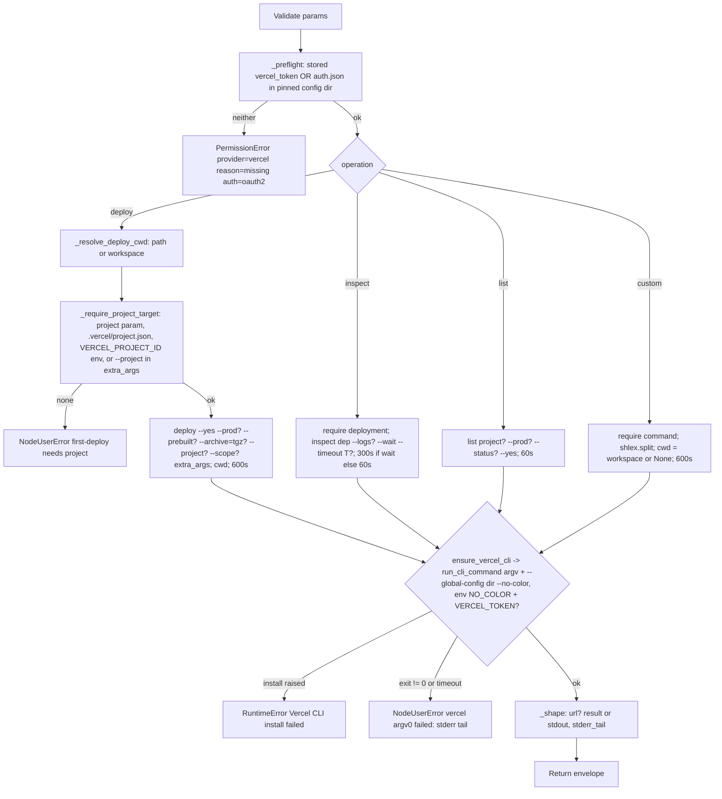

# Vercel (`vercelAction`)

| Field | Value |
|------|-------|
| **Category** | deployment (palette group `deployment`; class `group = ("deployment", "tool")`) |
| **Backend handler** | [`server/nodes/vercel/vercel_action.py`](../../../server/nodes/vercel/vercel_action.py) (`VercelActionNode`, on `ActionNode`); config pinning + token helpers in [`_service.py`](../../../server/nodes/vercel/_service.py); installer [`_install.py`](../../../server/nodes/vercel/_install.py); login WS handlers [`_handlers.py`](../../../server/nodes/vercel/_handlers.py) |
| **Tests** | [`server/tests/test_vercel_plugin.py`](../../../server/tests/test_vercel_plugin.py) |
| **Skill (if any)** | [`server/skills/vercel/vercel-skill/SKILL.md`](../../../server/skills/vercel/vercel-skill/SKILL.md) (`allowed-tools: "vercel"`) |
| **Dual-purpose tool** | yes - tool name `vercel` |

## Purpose

Deploy a directory to Vercel, inspect a deployment, list a project's
deployments, or run any other Vercel CLI command. Unlike the other CLI
nodes this one DOES pre-flight auth: each operation first requires either a
stored access token (injected as `VERCEL_TOKEN`) or a CLI login in the
OpenCompany-pinned `--global-config` directory, and raises an annotated
`PermissionError` otherwise so the framework emits the credential envelope.

## Inputs (handles)

| Handle | Connection type | Required | Purpose |
|--------|-----------------|----------|---------|
| `input-main` | main | no | Declared, but `hideInputHandle` is auto-set (`usable_as_tool = True`, class does not declare `hide_input_handle`) |

## Parameters

`extra="ignore"` on the model.

| Name | Type | Default | Required | displayOptions.show | Description |
|------|------|---------|----------|---------------------|-------------|
| `operation` | `deploy \| inspect \| list \| custom` | `deploy` | no | - | Operation dispatch key |
| `path` | string | `""` | no | `operation=deploy` | Directory to deploy: absolute, or relative to the workflow workspace; defaults to the workspace |
| `prod` | bool | `false` | no | `deploy`, `list` | `--prod` |
| `prebuilt` | bool | `false` | no | `operation=deploy` | `--prebuilt` |
| `archive` | bool | `false` | no | `operation=deploy` | `--archive=tgz` |
| `scope` | string | `""` | no | `operation=deploy` | `--scope <team>` |
| `extra_args` | string | `""` | no | `operation=deploy` | `shlex.split` and appended verbatim |
| `project` | string | `""` | yes* on first deploy | `deploy`, `list` | `--project <name>` for deploy; positional project for list |
| `deployment` | string | `""` | yes* | `operation=inspect` | Deployment URL or id positional |
| `logs` | bool | `false` | no | `operation=inspect` | `--logs` |
| `wait` | bool | `false` | no | `operation=inspect` | `--wait` |
| `timeout` | string | `"3m"` | no | `operation=inspect` | `--timeout <dur>`, only emitted when `wait` is true |
| `status` | string | `""` | no | `operation=list` | `--status <csv>` |
| `command` | string | `""` | yes* | `operation=custom` | Everything after `vercel `, `shlex.split` |

## Outputs (handles)

| Handle | Shape | Description |
|--------|-------|-------------|
| `output-main` | object | `VercelActionOutput`; `hideOutputHandle` auto-set |
| `output-tool` | - | Auto-appended for `usable_as_tool` |

### Output payload (TypeScript shape)

Keys omitted when empty; `extra="allow"`.

```ts
{
  operation: string;
  success: true;
  url?: string;           // deploy: stdout starting with "http" (the CLI prints only the deployment URL); custom: single-line stdout starting with "http"
  result?: unknown;       // parsed JSON stdout (custom commands with --json / --format=json)
  stdout?: string;        // human-readable text (list / inspect have no --json upstream)
  stderr_tail?: string;   // last 2000 chars of stderr (deploy progress lives here)
}
```

## Logic Flow



## Decision Logic

- **Pre-flight** (`_preflight`): `stored_token()` reads the `vercel_token`
  api-key row; `is_logged_in()` checks that `<DATA_DIR>/vercel/auth.json`
  exists and contains the substring `token`. Neither -> `PermissionError`
  annotated `provider="vercel"`, `reason="missing"`, `auth="oauth2"`, which
  `BaseNode.execute` turns into `error_type="PermissionDeniedError"` plus the
  `credential` envelope block and a `credential.oauth.runtime_failed`
  broadcast. When both exist the token wins (it rides `VERCEL_TOKEN`; the CLI
  gives env tokens precedence).
- **Validation** (`NodeUserError`): deploy cwd resolution (relative `path`
  without workspace, non-directory, or no path and no workspace); the
  first-deploy project guard; blank `deployment`; blank `command`.
- **First-deploy guard** (`_require_project_target`): satisfied by a
  non-blank `project`, an existing `<cwd>/.vercel/project.json`, a
  `VERCEL_PROJECT_ID` env var, or a literal `--project` token in
  `extra_args`. Otherwise it fails before uploading, because Vercel would
  derive a name from the workspace dir (`AI_Assistant_1`) and reject it late.
- **Working directory**: `deploy` uses `_resolve_deploy_cwd`; `custom` uses
  `ctx.workspace_dir` (may be `None`); `inspect` and `list` pass no cwd.
- **Timeouts**: 600 s deploy and custom; 300 s inspect with `wait`, else
  60 s; 60 s list.
- **Error paths**: install failure -> `RuntimeError` (generic branch);
  non-zero exit / timeout -> `NodeUserError` with the last 2000 chars of
  stderr.

## Side Effects

- **Subprocess**: one `vercel` process per op. Binary resolution order:
  in-process cache, `shutil.which("vercel")` (a system install is PREFERRED,
  unlike cf / gh / gcloud), the shared-tree shim
  `<DATA_DIR>/packages/node_modules/.bin/vercel(.cmd)`, then
  `npm install vercel@54.21.1 --prefix <DATA_DIR>/packages` in a worker
  thread under a lock followed by a best-effort `vercel telemetry disable`.
  Every invocation appends `--global-config <DATA_DIR>/vercel/ --no-color`;
  env = server env plus `NO_COLOR=1` and `VERCEL_TOKEN` when a token is
  stored.
- **File I/O**: `<DATA_DIR>/vercel/` is created on first use; `deploy`
  writes `.vercel/` into the deploy directory (CLI behaviour); `custom`
  directory-scoped commands run in the workspace.
- **Credential reads**: `auth_service.get_api_key("vercel_token")` per op.
- **Cost metadata**: every op declares
  `cost={"service": "vercel", "action": "<operation>", "count": 1}`.
- **Broadcasts**: standard node status; `credential.oauth.runtime_failed`
  via the annotated `PermissionError` path.

## External Dependencies

- **Credentials**: `VercelCredential` (`id = "vercel"`, `auth = "custom"`);
  `resolve()` returns `{"vercel_token": ...}` when the optional api-key row
  exists, else `{}`. The CLI login state (`auth.json`) lives in the pinned
  config dir and is written by the `vercel_login` WS handler's device flow;
  the modal badge is the synthetic `cli-managed` marker OAuth row.
- **Services**: Vercel API via the CLI; npm registry for the install.
- **Python packages**: `pydantic`; `services.events.run_cli_command`.
- **Environment variables**: `VERCEL_TOKEN` (injected), `VERCEL_PROJECT_ID`
  (read by the guard), `NO_COLOR`.

## Edge cases & known limits

- `list` and `inspect` output is human-readable text (no `--json` upstream);
  agents work with `stdout` directly.
- `prod` is shared by `deploy` and `list` (it filters production
  deployments on `list`).
- `timeout` is a Vercel duration string (`3m`), not seconds, and only
  reaches argv when `wait` is set.
- `extra_args` are appended after the typed flags, so a duplicate flag there
  is resolved by the CLI, not by the node.
- `ui_hints = {"outputMode": "terminal"}`; `annotations.destructive` is
  `False` although `deploy --prod` and `custom rollback` mutate state.
- Because a system `vercel` is preferred, argv shapes may meet a version
  other than the pinned one.

## Related

- **Skills using this as a tool**: [vercel-skill](../../../server/skills/vercel/vercel-skill/SKILL.md)
- **Siblings**: [`cloudflareAction`](./cloudflareAction.md), [`gcloudAction`](./gcloudAction.md), [`githubAction`](./githubAction.md)
- **Architecture docs**: [Vercel Service](../../vercel_service.md), [Stripe Service](../../stripe_service.md) (the origin of the CLI-managed-auth pattern)
