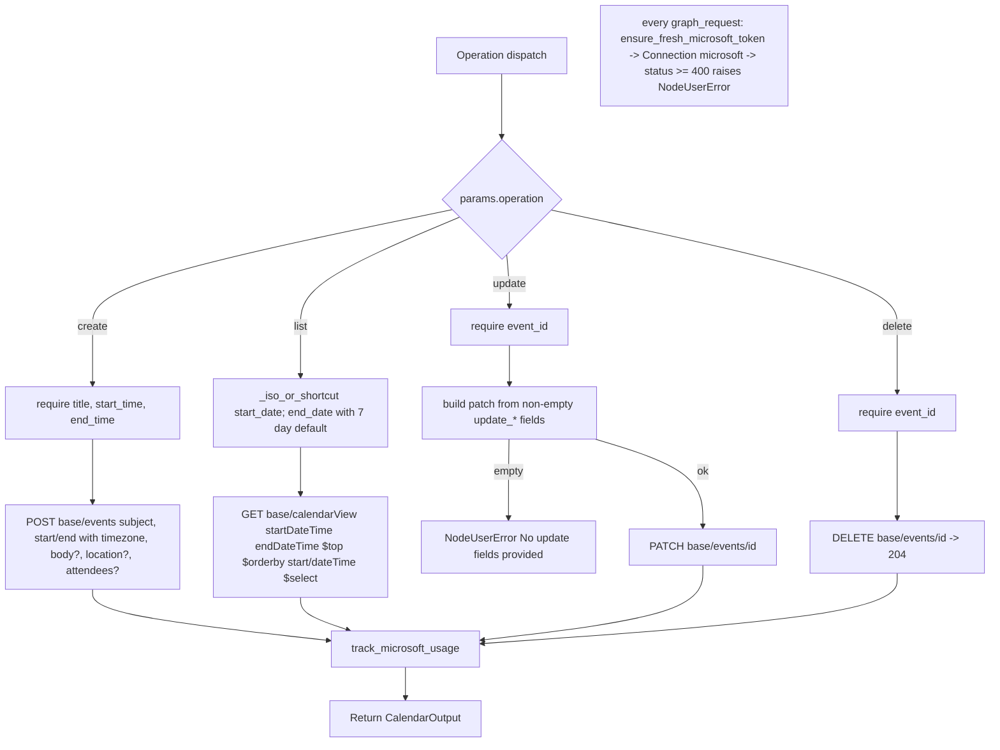

# Outlook Calendar (`msCalendar`)

| Field | Value |
|------|-------|
| **Category** | microsoft (class `group = ("microsoft", "tool")`) |
| **Backend handler** | [`server/nodes/microsoft/calendar/__init__.py`](../../../server/nodes/microsoft/calendar/__init__.py) (`CalendarNode`, on `ActionNode`); Graph plumbing in [`_base.py`](../../../server/nodes/microsoft/_base.py) (`graph_request`, `mailbox_base`, `track_microsoft_usage`); token refresh in [`_auth_helper.py`](../../../server/nodes/microsoft/_auth_helper.py) |
| **Tests** | [`server/tests/nodes/test_microsoft.py`](../../../server/tests/nodes/test_microsoft.py) |
| **Skill (if any)** | [`server/skills/productivity_agent/ms-calendar-skill/SKILL.md`](../../../server/skills/productivity_agent/ms-calendar-skill/SKILL.md) (`allowed-tools: "ms_calendar"`) |
| **Dual-purpose tool** | yes - tool name `ms_calendar` |

## Purpose

Create, list, update and delete Outlook Calendar events through Microsoft
Graph v1.0, for the signed-in user's calendar or a shared mailbox's
calendar. `list` reads `calendarView` over a date window that accepts
`today` / `today+Nd` shortcuts. Same auth and bookkeeping plumbing as
[`msMail`](./msMail.md): proactive token refresh, `Connection` facade, one
zero-cost usage row per operation.

## Inputs (handles)

| Handle | Connection type | Required | Purpose |
|--------|-----------------|----------|---------|
| `input-main` | main | no | Declared, but `hideInputHandle` is auto-set (`usable_as_tool = True`, class does not declare `hide_input_handle`) |

## Parameters

`extra="ignore"` on the model.

| Name | Type | Default | Required | displayOptions.show | Description |
|------|------|---------|----------|---------------------|-------------|
| `operation` | `create \| list \| update \| delete` | `list` | no | - | Operation dispatch key |
| `mailbox` | string | `""` | no | - (always shown) | Shared mailbox address; empty targets `/me`, else `/users/{address}` |
| `event_id` | string | `""` | yes* | `update`, `delete` | Graph event id |
| `title` | string | `""` | yes* | `operation=create` | Event `subject` |
| `body` | string | `""` | no | `operation=create` | Text body |
| `start_time` | string | `""` | yes* | `operation=create` | ISO 8601 local datetime |
| `end_time` | string | `""` | yes* | `operation=create` | ISO 8601 local datetime |
| `location` | string | `""` | no | `operation=create` | `location.displayName` |
| `attendees` | string | `""` | no | `operation=create` | Comma- or semicolon-separated; all typed `required` |
| `timezone` | string | `UTC` | no | `operation=create` | `timeZone` for start / end. Also applied by `update` (see Decision Logic) |
| `start_date` | string | `""` | no | `operation=list` | ISO datetime, `today`, or `today+Nd`; empty = today 00:00 UTC |
| `end_date` | string | `""` | no | `operation=list` | ISO datetime, `today`, or `today+Nd`; empty = now + 7 days |
| `max_results` | int (1..250) | `10` | no | `operation=list` | `$top` |
| `update_title` | string | `""` | no | `operation=update` | `subject` patch |
| `update_start_time` | string | `""` | no | `operation=update` | `start.dateTime` patch |
| `update_end_time` | string | `""` | no | `operation=update` | `end.dateTime` patch |
| `update_body` | string | `""` | no | `operation=update` | Text body patch |
| `update_location` | string | `""` | no | `operation=update` | `location.displayName` patch |

## Outputs (handles)

| Handle | Shape | Description |
|--------|-------|-------------|
| `output-main` | object | `CalendarOutput`; `hideOutputHandle` auto-set |
| `output-tool` | - | Auto-appended for `usable_as_tool` |

### Output payload (TypeScript shape)

The op returns a `CalendarOutput` instance; unset fields are omitted.

```ts
// create and update
{ operation: "create" | "update"; event_id: string; title: string; start: string; end: string;
  location: string; web_link: string }
// list
{ operation: "list"; count: number; time_range: { start: string; end: string };
  events: Array<{ event_id, title, start, end, location, organizer, web_link, is_all_day }> }
// delete
{ operation: "delete"; deleted: true; event_id: string }
```

## Logic Flow



## Decision Logic

- **Validation** (`NodeUserError`): `create` needs `title`, `start_time`
  and `end_time`; `update` and `delete` need `event_id`; `update` with no
  non-empty `update_*` field; unknown operation; invalid `mailbox`.
- **Date shortcuts** (`_iso_or_shortcut`, `datetime.utcnow()` based, naive
  ISO output): empty or `today` with `default_offset_days == 0`
  (`start_date`) -> today at 00:00:00; empty or `today` with the 7-day
  default (`end_date`) -> now plus 7 days (NOT midnight); `today+Nd` ->
  now plus N days; anything else passes through verbatim. A malformed
  `today+...` value raises `ValueError` from `int()`, which is not a
  `NodeUserError`.
- **`list`**: `$top = min(max_results, 250)`, `$orderby=start/dateTime`,
  `$select=id,subject,start,end,location,organizer,webLink,isAllDay`;
  usage count = number returned; `time_range` echoes the resolved window.
- **`create`**: `body` is always `contentType: Text`; `attendees` entries
  are `{"emailAddress": {"address"}, "type": "required"}`.
- **`update`**: only supplied fields are patched. `update_start_time` /
  `update_end_time` reuse the `timezone` param, whose `displayOptions` show
  it only for `create` - through the panel an update therefore always uses
  the default `UTC` unless the field was set while the operation was
  `create`; tool calls can pass it explicitly. `event_id` in the output
  falls back to the param when Graph's response lacks `id`.
- **`delete`**: Graph returns 204 -> `graph_request` yields `None`; output
  is `{deleted: true, event_id}`.
- **Auth**: identical to `msMail` - `ensure_fresh_microsoft_token` raises an
  annotated `PermissionError` (`provider="microsoft"`, `reason="missing"`,
  `auth="oauth2"`) when not connected; the first call per process refreshes;
  refresh failures fall back to the stored token.
- **Error paths**: Graph status >= 400 -> `NodeUserError("Microsoft Graph
  error (<status>): <code>: <message>")`.

## Side Effects

- **Database writes**: one `api_usage_metrics` row per op
  (`service="microsoft_graph"`; `create` -> `event_create`, `list` ->
  `event_list`, `update` -> `event_update`, `delete` -> `event_delete`;
  cost 0.0). Token refresh persists tokens via
  `auth_service.store_oauth_tokens`.
- **External API calls**: `POST {base}/events`, `GET {base}/calendarView`,
  `PATCH {base}/events/{id}`, `DELETE {base}/events/{id}` on
  `https://graph.microsoft.com/v1.0` with `Authorization: Bearer`.
- **Broadcasts**: standard node status only.
- **File I/O**: none.

## External Dependencies

- **Credentials**: `MicrosoftCredential` (`id = "microsoft"`, OAuth2,
  authority `/organizations`; `Calendars.ReadWrite` and
  `Calendars.ReadWrite.Shared` among the scopes in
  `server/config/microsoft_apis.json`; `microsoft_client_id` /
  `microsoft_client_secret` api-key rows).
- **Services**: Microsoft Graph v1.0; `login.microsoftonline.com` for
  refresh.
- **Python packages**: `httpx`, `pydantic`; `services.plugin.connection`.
- **Environment variables**: none read directly.

## Edge cases & known limits

- `start_time` / `end_time` are sent verbatim; an unparseable value is
  rejected by Graph (surfaced as `NodeUserError`), not by the node.
- `list` uses `calendarView`, so recurring-event instances are expanded;
  `is_all_day` rides along per instance.
- `create` sends attendees invitations as Graph normally does for a POST
  to `/events` (no `sendNotifications` control is exposed).
- `annotations = {"destructive": False, ...}` although `delete` removes
  events.
- Shared calendars require Full Access on the mailbox plus the `.Shared`
  scope; the node cannot detect the missing grant ahead of Graph's 403.

## Related

- **Skills using this as a tool**: [ms-calendar-skill](../../../server/skills/productivity_agent/ms-calendar-skill/SKILL.md)
- **Siblings**: [`msMail`](./msMail.md), [`msMailReceive`](./msMailReceive.md)
- **Architecture docs**: [Plugin System](../../plugin_system.md), [Pricing Service](../../pricing_service.md)
