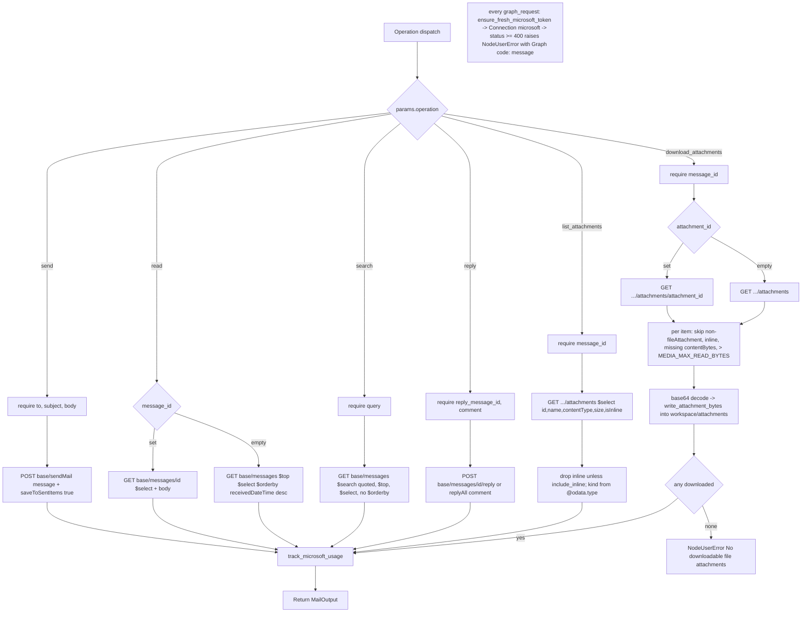

# Outlook Mail (`msMail`)

| Field | Value |
|------|-------|
| **Category** | microsoft (class `group = ("microsoft", "tool")`) |
| **Backend handler** | [`server/nodes/microsoft/mail/__init__.py`](../../../server/nodes/microsoft/mail/__init__.py) (`MailNode`, on `ActionNode`); Graph plumbing in [`_base.py`](../../../server/nodes/microsoft/_base.py) (`graph_request`, `mailbox_base`, `write_attachment_bytes`, `track_microsoft_usage`); token refresh in [`_auth_helper.py`](../../../server/nodes/microsoft/_auth_helper.py) |
| **Tests** | [`server/tests/nodes/test_microsoft.py`](../../../server/tests/nodes/test_microsoft.py) |
| **Skill (if any)** | [`server/skills/productivity_agent/ms-mail-skill/SKILL.md`](../../../server/skills/productivity_agent/ms-mail-skill/SKILL.md) (`allowed-tools: "ms_mail"`) |
| **Dual-purpose tool** | yes - tool name `ms_mail` |

## Purpose

Send, read, search and reply to Outlook mail through Microsoft Graph v1.0,
and list or download a message's file attachments into the workflow
workspace so a document parser can read them. Graph is plain bearer REST:
the node uses the `Connection` facade (token injected as `Authorization:
Bearer`, one retry on 401 / 403) after proactively refreshing the stored
access token, and each operation records a zero-cost usage row.

## Inputs (handles)

| Handle | Connection type | Required | Purpose |
|--------|-----------------|----------|---------|
| `input-main` | main | no | Declared, but `hideInputHandle` is auto-set (`usable_as_tool = True`, class does not declare `hide_input_handle`) |

## Parameters

`extra="ignore"` on the model.

| Name | Type | Default | Required | displayOptions.show | Description |
|------|------|---------|----------|---------------------|-------------|
| `operation` | `send \| read \| search \| reply \| list_attachments \| download_attachments` | `send` | no | - | Operation dispatch key |
| `mailbox` | string | `""` | no | - (always shown) | Shared mailbox address; empty targets `/me`, otherwise `/users/{address}`. A value containing `/` or a space raises `NodeUserError` |
| `to` | string | `""` | yes* | `operation=send` | Comma- or semicolon-separated recipients |
| `cc` | string | `""` | no | `operation=send` | Same format |
| `bcc` | string | `""` | no | `operation=send` | Same format |
| `subject` | string | `""` | yes* | `operation=send` | - |
| `body` | string | `""` | yes* | `operation=send` | Message body |
| `body_type` | `text \| html` | `text` | no | `operation=send` | Graph `contentType` `Text` / `HTML` |
| `message_id` | string | `""` | no for read; yes* for attachment ops | `read`, `list_attachments`, `download_attachments` | Graph message id; empty on `read` lists recent messages instead |
| `max_results` | int (1..100) | `10` | no | `operation=read` | `$top` for the list form of `read` |
| `query` | string | `""` | yes* | `operation=search` | Graph `$search` text (quoted by the node) |
| `search_max_results` | int (1..100) | `10` | no | `operation=search` | `$top` |
| `reply_message_id` | string | `""` | yes* | `operation=reply` | Message to reply to |
| `comment` | string | `""` | yes* | `operation=reply` | Reply text |
| `reply_all` | bool | `false` | no | `operation=reply` | `replyAll` instead of `reply` |
| `attachment_id` | string | `""` | no | `list_attachments`, `download_attachments` | Download only this attachment (ignored by `list_attachments`) |
| `include_inline` | bool | `false` | no | `list_attachments`, `download_attachments` | Include `isInline` attachments (signature images) |

## Outputs (handles)

| Handle | Shape | Description |
|--------|-------|-------------|
| `output-main` | object | `MailOutput`; `hideOutputHandle` auto-set |
| `output-tool` | - | Auto-appended for `usable_as_tool` |

### Output payload (TypeScript shape)

The op returns a `MailOutput` instance, dumped with `mode="json"`; unset
fields are omitted. Note the sender key is `from_` (the Python field has no
alias), so downstream templates use `{{msMail.from_}}`.

```ts
// send
{ operation: "send"; sent: true; to: string; subject: string }
// read (message_id given)
{ operation: "read"; message_id: string; subject: string; from_: string; received: string;
  body_preview: string; body: string; has_attachments: boolean; web_link: string }
// read (no message_id) and search
{ operation: "read" | "search"; messages: Array<{ message_id, subject, from, from_name, received,
  body_preview, is_read, has_attachments, web_link }>; count: number; query?: string }
// reply
{ operation: "reply"; replied: true; message_id: string }
// list_attachments
{ operation: "list_attachments"; count: number;
  attachments: Array<{ attachment_id, name, content_type, size, is_inline, kind: "file" | "item" | "reference" | "unknown" }> }
// download_attachments
{ operation: "download_attachments"; count: number; download_dir: string;   // absolute <workspace>/attachments
  attachments: Array<{ filename, path /* absolute */, mime_type, size, ref: FileRef /* kind "file" */ }>;
  skipped?: Array<{ name, reason }> }
```

## Logic Flow



## Decision Logic

- **Validation** (`NodeUserError`): `send` needs `to`, `subject`, `body`;
  `search` needs `query`; `reply` needs `reply_message_id` and `comment`;
  attachment ops need `message_id`; unknown operation; invalid `mailbox`.
- **Mailbox targeting**: `mailbox_base(mailbox)` -> `/me` or
  `/users/{address}` for every op; a shared mailbox requires Full Access
  (and Send As for `send`) plus the `.Shared` scopes.
- **`read` branches**: with `message_id`, one message with `body`
  (`$select` = `id,subject,from,receivedDateTime,bodyPreview,isRead,
  hasAttachments,webLink,body`) and usage count 1; without, the list form
  with `$top = min(max_results, 100)`, ordered newest first, usage count =
  number returned.
- **`search`**: `$search` is wrapped in double quotes; `$orderby` is
  deliberately absent (Graph rejects the combination).
- **`list_attachments`**: `$select` excludes `contentBytes`, so no payload
  is fetched; `kind` is `file` for `#microsoft.graph.fileAttachment`,
  otherwise the `@odata.type` suffix (`itemAttachment` -> `itemAttachment`
  string tail) or `unknown`.
- **`download_attachments` skip reasons**: non-`fileAttachment` type, inline
  without `include_inline`, missing `contentBytes` (Graph may omit it for
  large attachments), decoded size above `MEDIA_MAX_READ_BYTES` (25 MiB).
  Nothing downloaded -> `NodeUserError` listing the skips; otherwise
  `skipped` is included only when non-empty.
- **Token freshness** (`ensure_fresh_microsoft_token`): no stored tokens ->
  `PermissionError` annotated `provider="microsoft"`, `reason="missing"`,
  `auth="oauth2"` (credential envelope + `credential.oauth.runtime_failed`).
  The in-process expiry map is empty on first use, so the first call after
  a restart always refreshes (needs the stored refresh token and the
  `microsoft_client_id` api-key row); a failed refresh falls back to the
  stored access token silently. Refresh margin is 120 s; unknown
  `expires_in` assumes 3600 s.
- **Error paths**: Graph status >= 400 -> `NodeUserError("Microsoft Graph
  error (<status>): <code>: <message>")`; 204 / empty body -> `None`
  result, which the ops treat as `{}`.

## Side Effects

- **Database writes**: one `api_usage_metrics` row per op via
  `track_microsoft_usage` (`service="microsoft_graph"`, `operation` mapped
  through `pricing.json` `operation_map.microsoft_graph` - `send` ->
  `mail_send`, `read` -> `mail_read`, `search` -> `mail_search`, `reply` ->
  `mail_reply`, `list_attachments` -> `mail_list_attachments`,
  `download_attachments` -> `mail_download_attachments`; cost 0.0;
  `resource_count` = 1 or the number of items). Token refresh persists new
  access / refresh tokens via `auth_service.store_oauth_tokens`.
- **External API calls**: `POST {base}/sendMail`, `GET {base}/messages[/{id}]`,
  `POST {base}/messages/{id}/reply|replyAll`,
  `GET {base}/messages/{id}/attachments[/{id}]` on
  `https://graph.microsoft.com/v1.0`, bearer auth; the OAuth token endpoint
  on refresh.
- **File I/O**: `download_attachments` writes
  `<workspace>/attachments/<slug>-<node8>-<uuid6>.<ext>` atomically
  (`atomic_write_bytes`, containment via `resolve_media`) and returns a
  `FileRef(kind="file")` plus the absolute path.
- **Broadcasts**: standard node status only.

## External Dependencies

- **Credentials**: `MicrosoftCredential` (`id = "microsoft"`, `OAuth2Credential`;
  client credentials in api-key rows `microsoft_client_id` /
  `microsoft_client_secret`; authority `/organizations` - Work / School
  accounts only). Scopes from `server/config/microsoft_apis.json`:
  `openid profile email offline_access User.Read Mail.Send Mail.ReadWrite
  Mail.ReadWrite.Shared Mail.Send.Shared Calendars.ReadWrite
  Calendars.ReadWrite.Shared`. Connected via the `microsoft_oauth_login` WS
  handler and `GET /api/microsoft/callback`.
- **Services**: Microsoft Graph v1.0; `login.microsoftonline.com` for
  refresh.
- **Python packages**: `httpx`, `pydantic`; `services.plugin.connection`,
  `services.media` (`FileRef`, `resolve_media`, `workspace_root`),
  `nodes.filesystem._backend.atomic_write_bytes`.
- **Environment variables**: none read directly.

## Edge cases & known limits

- The output field is `from_`, not `from` (no alias on the Pydantic field);
  the list entries inside `messages` use `from`.
- `read` without `message_id` always caps at 100 and ignores `query`.
- `download_attachments` needs a resolvable workspace (`workspace_root(ctx)`);
  attachments over ~3 MB may arrive without `contentBytes` and are skipped
  with reason "no contentBytes" - the Graph upload / download session API
  is out of scope.
- `list_attachments` counts only the returned (post-filter) attachments
  toward usage.
- Graph throttling (per mailbox) surfaces as a 429 `NodeUserError`; the
  `Connection` retry covers 401 / 403 only.
- `annotations = {"destructive": False, ...}`.

## Related

- **Skills using this as a tool**: [ms-mail-skill](../../../server/skills/productivity_agent/ms-mail-skill/SKILL.md) (pairs `download_dir` with the document parser's `input_dir`)
- **Siblings**: [`msMailReceive`](./msMailReceive.md), [`msCalendar`](./msCalendar.md)
- **Architecture docs**: [Plugin System](../../plugin_system.md), [Media Transport](../../media_transport.md), [Pricing Service](../../pricing_service.md)
