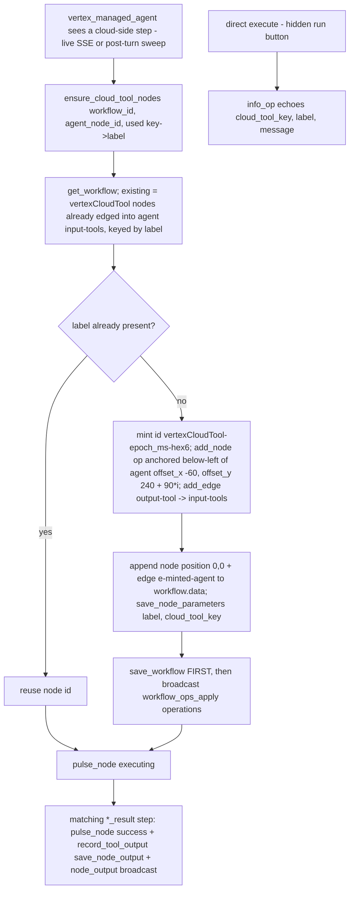

# Cloud Tool (`vertexCloudTool`)

| Field | Value |
|------|-------|
| **Category** | specialized_agents (palette group `tool`; display-only companion of `vertex_managed_agent`) |
| **Plugin** | [`server/nodes/agent/vertex_cloud_tool/__init__.py::VertexCloudToolNode.info_op`](../../../server/nodes/agent/vertex_cloud_tool/__init__.py); minted, wired, pulsed and fed by [`nodes/agent/vertex_managed_agent/_ops.py`](../../../server/nodes/agent/vertex_managed_agent/_ops.py) (`ensure_cloud_tool_nodes`, `pulse_node`, `record_tool_output`) |
| **Dispatch** | `BaseNode.execute()` + `@Operation("info")` — but the executor never schedules it (a node wired into an agent's `input-tools` is a sub-node) and the run button is hidden |
| **Tests** | [`server/tests/nodes/test_vertex_agents.py::TestCloudToolMinting`](../../../server/tests/nodes/test_vertex_agents.py) |
| **Skill (if any)** | none |
| **Dual-purpose tool** | no - `usable_as_tool = False`, `component_kind = "square"`; excluded from `iter_tool_node_classes` and skipped by `vertex_managed_agent._is_declarable_tool_type` |

## Purpose

The canvas-visible trace of work that happened in Google's cloud. The
managed agent runs entirely remotely, so when it uses a cloud-side tool
(sandbox `run_command`, `code_execution`, `google_search`, `url_context`,
an MCP tool) the parent `vertex_managed_agent` mints one of these nodes per
distinct tool, wires it into its own `input-tools` handle, and pulses it
`executing` -> `success` around each use. Clicking the node shows the
recorded invocation (arguments + result) in the Output panel exactly like a
locally executed tool. It performs no work itself and is safe to delete.

## Inputs (handles)

| Handle | Connection type | Required | Purpose |
|--------|-----------------|----------|---------|
| `output-tool` (source, top) | tools | - | The only handle: connects upward into the agent's bottom `input-tools` (house-shaped tool-node convention). No `input-main`. |

`group = ("tool",)` auto-derives `uiHints.isConfigNode = true`; the class
adds `hideRunButton`. `component_kind` is `square` (not `tool`) so it
renders through `SquareNode` without the tool-schema editor panel.

## Parameters

Params model `VertexCloudToolParams` (`extra="ignore"`) — set by the
minting helper, not meant to be edited by hand. It exists so the node has an
input schema registered in `NODE_INPUT_MODELS` (plugins on the default empty
Params are not registered, which leaves the parameter panel schema-less).

| Name | Type | Default | Required | displayOptions.show | Description |
|------|------|---------|----------|---------------------|-------------|
| `cloud_tool_key` | string \| null | `null` | no | - | Stable key of the cloud-side tool: `type:<step_type>` (`code_execution_call`, `google_search_call`, `url_context_call`, `mcp_server_tool_call`) or `fn:<name>` for undeclared `function_call` steps |
| `label` | string \| null | `null` | no | - | Display label (`Code Execution`, `Google Search`, `URL Context`, `MCP Tool`, or the raw function name) |

## Outputs (handles)

| Handle | Shape | Description |
|--------|-------|-------------|
| (none declared as `main`) | - | `info_op` returns `VertexCloudToolOutput`; the value users actually see in the Output panel is the invocation record written by `record_tool_output`, not this echo |

### Output payload (TypeScript shape)

```ts
// info_op echo (only if someone executes the node directly)
{ cloud_tool_key: string | null; label: string | null; message: string }

// what record_tool_output persists as output_0 / broadcasts as node_output
{
  tool: string;                 // display label
  arguments: unknown;           // JSON-safe dump of the call step's arguments
  result: unknown;              // JSON-safe dump of the matching *_result step (or the whole step)
  is_error: boolean;
  timestamp: string;
}
```

## Logic Flow



## Decision Logic

- **Validation**: none in the node. Minting requires a saved workflow (`get_workflow` returns `None` -> no nodes minted, empty map returned).
- **Branches**: dedupe is by `label` among display nodes already wired to that agent; a key whose label matches an existing node reuses it without a DB write. The live handler memoizes `live_nodes[key]` per run so each key costs one DB round-trip; the post-turn sweep mints only keys the stream missed and pulses them `executing` then `success` back-to-back.
- **Fallbacks**: `_CLOUD_NOISE_NAMES` (`provision_sandbox`) is never minted; declared local tools are never minted (they are real nodes executed at `requires_action`).
- **Error paths**: minting/pulsing/recording failures are best-effort — `record_tool_output` logs `exception` and returns without broadcasting when the DB write fails; the agent's sweep wraps everything in `try/except` and logs.

## Side Effects

- **Database writes** (all performed by `_ops`, on behalf of the agent): `workflow.data` nodes + edges rewrite (`save_workflow` with unchanged name/slug/description), `node_parameters` row `{label, cloud_tool_key}` per minted node, `node_outputs` row (`session_id "default"`, `output_0`) per recorded invocation.
- **Broadcasts**: `workflow_ops_apply` `{workflow_id, caller_node_id, operations}` (each `add_node` op carries `minted_id` so backend status broadcasts glow the exact node the frontend creates), `node_status` `executing` / `success` with message "Used by Vertex agent", `node_output`.
- **External API calls / File I/O / Subprocess**: none.

## External Dependencies

- **Credentials**: none.
- **Services**: `services.workflow_ops` (`add_node`, `add_edge`, `anchored`), `StatusBroadcaster`, `services.plugin.deps.get_database`.
- **Task queue**: `TaskQueue.REST_API` (never actually dispatched). Annotations: `readonly`.

## Edge cases & known limits

- Deleting the node is safe, but the next run that uses the same cloud tool mints it again.
- Persisted position is the `{0, 0}` placeholder; the anchored position exists only in the broadcast op. If no client is connected to apply the op and auto-save, the node reloads at the canvas origin.
- Dedupe is label-based, so two distinct keys sharing a label collapse into one node; conversely two agents on the same canvas each get their own copies (dedupe is scoped to edges targeting the minting agent).
- `label` is `node.data.label`, which the user can F2-rename; a renamed display node no longer dedupes and a fresh one is minted beside it.
- Because the node sits on `input-tools`, `_is_declarable_tool_type` must skip it or the agent would declare a function tool with an empty schema; the exclusion is by `component_kind == "square"` + `usable_as_tool = False`, not by type string.
- Recorded outputs use `session_id = "default"` regardless of the run's session, matching what the Output panel fetches.

## Related

- **Owner**: [`vertex_managed_agent`](./vertex_managed_agent.md) (only producer of these nodes).
- **Same minting pattern**: [`agentBuilder`](../ai_tools/agentBuilder.md) (workflow-ops push broadcast).
- **Architecture docs**: [workflow_ops_protocol.md](../../workflow_ops_protocol.md), [status_broadcaster.md](../../status_broadcaster.md).
