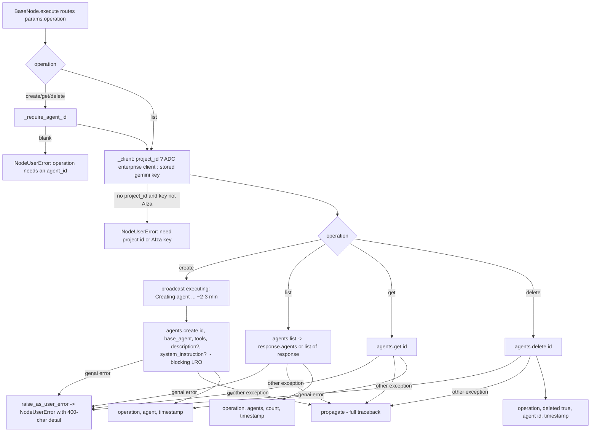

# Vertex Agent Admin (`vertex_agent_admin`)

| Field | Value |
|------|-------|
| **Category** | specialized_agents (palette group `agent` — deliberately not `tool`, which would auto-derive a bogus `isConfigNode` hint) |
| **Plugin** | [`server/nodes/agent/vertex_agent_admin/__init__.py::VertexAgentAdminNode`](../../../server/nodes/agent/vertex_agent_admin/__init__.py) — four `@Operation`s (`create_op` / `list_op` / `get_op` / `delete_op`) selected by the `operation` parameter via `BaseNode.execute()`; shared helpers in [`nodes/agent/_vertex.py`](../../../server/nodes/agent/_vertex.py) |
| **Dispatch** | Plain `ActionNode`, `component_kind = "square"`; not an agent loop, no `SpecializedAgentBase`, no edge walking |
| **Tests** | [`server/tests/nodes/test_vertex_agents.py::TestVertexAgentAdmin`](../../../server/tests/nodes/test_vertex_agents.py) |
| **Skill (if any)** | [`server/skills/vertex_agent/vertex-agent-admin-skill/SKILL.md`](../../../server/skills/vertex_agent/vertex-agent-admin-skill/SKILL.md) names it in `allowed-tools`, but see Dual-purpose |
| **Dual-purpose tool** | no - `usable_as_tool = False` (lifecycle CRUD including delete is operator-facing, not LLM-callable); `iter_tool_node_classes` never yields it |

## Purpose

Operator-facing lifecycle CRUD for **custom managed agents** on the Gemini
Enterprise Agent Platform (Agents API): create a custom agent on top of the
prebuilt Antigravity base agent with its own system instruction and
built-in cloud tool set, list the project's agents, inspect one, or delete
one. The resulting `agent_id` is what a [`vertex_managed_agent`](./vertex_managed_agent.md)
node puts in its `agent` parameter. Creation is a long-running operation
(~2-3 minutes the first time, seconds afterwards); the Python SDK blocks
until it resolves.

## Inputs (handles)

| Handle | Connection type | Required | Purpose |
|--------|-----------------|----------|---------|
| `input-main` | main | no | Upstream data via templates (e.g. an `agent_id` produced upstream) |

`usable_as_tool` is `False` and `component_kind` is `square`, so the base
class does not hide the canvas handles and no `output-tool` handle is
synthesized.

## Parameters

Params model `VertexAgentAdminParams` (`extra="ignore"`):

| Name | Type | Default | Required | displayOptions.show | Description |
|------|------|---------|----------|---------------------|-------------|
| `operation` | enum `create` \| `list` \| `get` \| `delete` | `list` | no | - | Selects the `@Operation` |
| `project_id` | string | `""` | no | - | GCP project id (ADC auth). Empty -> stored `AIza` Gemini key |
| `agent_id` | string \| null | `null` | required by `create` / `get` / `delete` (`NodeUserError` when blank) | `operation: [create, get, delete]` | Custom agent id ("lowercase letters, numbers, hyphens" per the description; not validated locally) |
| `description` | string \| null | `null` | no | `operation: [create]` | Agent description (omitted from the create call when empty) |
| `system_instruction` | string \| null (3 rows) | `null` | no | `operation: [create]` | Agent system instruction (omitted when empty) |
| `base_agent` | string | `antigravity-preview-05-2026` | no | `operation: [create]` | Base managed agent; an empty string falls back to the default |
| `tools` | list of `code_execution` \| `filesystem` \| `google_search` \| `url_context` | `["code_execution"]` | no | `operation: [create]` | Built-in cloud tools, sent as `[{"type": <name>}, ...]` |
| `location` | string | `global` | no | group `options` | Passed to the enterprise client only (ignored with an API key) |

No `api_key` field and **no auto-injection**: the type is not in
`AI_MODEL_TYPES`, so `_client` calls `resolve_gemini_api_key_from_store()`
(`auth.get_api_key("gemini", "default")`, exceptions -> `""`) whenever
`project_id` is empty.

## Outputs (handles)

| Handle | Shape | Description |
|--------|-------|-------------|
| `output-main` | object | `VertexAgentAdminOutput` (`extra="allow"`) in the standard envelope; unset fields are dropped at serialization |

### Output payload (TypeScript shape)

```ts
// create / get
{ operation: 'create' | 'get'; agent: Record<string, unknown>; timestamp: string }
// list
{ operation: 'list'; agents: Array<Record<string, unknown>>; count: number; timestamp: string }
// delete
{ operation: 'delete'; deleted: true; agent: { id: string }; timestamp: string }
```

`agent` records are `model_dump(mode="json", exclude_none=True)` of the SDK
object (a dict passes through; anything else becomes `{id: str(obj)}`).

## Logic Flow



## Decision Logic

- **Validation**: `agent_id` must be non-blank for `create` / `get` / `delete`; no format check is performed locally (the API rejects bad ids). `list` needs nothing.
- **Branches**: auth surface — `project_id` set -> `genai.Client(enterprise=True, project, location)` with ADC; otherwise the stored gemini key must start with `AIza` or `build_genai_client` raises `NodeUserError` (`AQ.` keys are rejected). `list` tolerates both a response object exposing `.agents` and an iterable response (a plain dict response yields an empty list).
- **Fallbacks**: `base_agent` empty -> `DEFAULT_MANAGED_AGENT`; `description` / `system_instruction` are omitted from the create call rather than sent empty.
- **Error paths**: every SDK exception whose class lives under `google.genai` becomes `NodeUserError("Agent <op> '<id>' failed: <detail>")` (one WARN line); anything else propagates as a genuine error.

## Side Effects

- **Database writes**: none (the `cost={"service": "vertex_agent", ...}` on each operation is inert — no code reads `OperationSpec.cost`).
- **Broadcasts**: `update_node_status(node_id, "executing", {message: "Creating agent '<id>' (first create takes ~2-3 min)..."})` on `create` only.
- **External API calls**: `client.aio.agents.create / list / get / delete` on the Agent Platform (enterprise, ADC) or `generativelanguage.googleapis.com` (API key).
- **File I/O / Subprocess**: none.

## External Dependencies

- **Credentials**: stored `gemini` API key (read directly from the credential store) or gcloud ADC with `project_id`.
- **Services**: `services.plugin.deps.get_ai_service().auth` (key lookup), `StatusBroadcaster`.
- **Python packages**: `google-genai`.
- **Task queue**: `TaskQueue.REST_API`. Annotations: `destructive`, `open_world`.

## Edge cases & known limits

- `create` blocks the activity for the whole long-running operation; there is no polling, no progress broadcast after the initial message, and the default 10-minute action `start_to_close_timeout` applies (the class does not raise it).
- `delete` is irreversible and has no confirmation; deleting an agent does not delete past interactions or sandboxes (they expire on their own TTL).
- `location` is silently ignored on the API-key path.
- The skill doc's field rules ("1-63 chars, must start with a letter") are documentation only — the node passes `agent_id` through verbatim.
- The skill names this node in `allowed-tools`, yet the node is not LLM-callable; the skill functions as operator documentation, not as a tool binding.
- A missing gemini key with an empty `project_id` surfaces as the generic "need a project id or AIza key" `NodeUserError`, not as the annotated credential envelope.

## Related

- **Consumer**: [`vertex_managed_agent`](./vertex_managed_agent.md) runs the agents created here (`agent` parameter).
- **Skill**: [`vertex-agent-admin-skill`](../../../server/skills/vertex_agent/vertex-agent-admin-skill/SKILL.md).
- **Architecture docs**: [plugin_system.md](../../plugin_system.md), [agent_architecture.md](../../agent_architecture.md).
