# Vertex Agent (`vertex_managed_agent`)

| Field | Value |
|------|-------|
| **Category** | specialized_agents (palette group `agent`) |
| **Plugin** | [`server/nodes/agent/vertex_managed_agent/__init__.py::VertexManagedAgentNode.execute_op`](../../../server/nodes/agent/vertex_managed_agent/__init__.py) (dispatch via `BaseNode.execute()` + `@Operation("execute")`; helpers: [`nodes/agent/_vertex.py`](../../../server/nodes/agent/_vertex.py) client/auth/stream, [`vertex_managed_agent/_ops.py`](../../../server/nodes/agent/vertex_managed_agent/_ops.py) cloud-tool node minting, [`nodes/agent/_handles.py`](../../../server/nodes/agent/_handles.py) topology) |
| **Dispatch** | **Own path** — an `ActionNode` with `component_kind = "agent"`, NOT a `SpecializedAgentBase` subclass; never calls `prepare_agent_call` / `AIService.execute_chat_agent` / `run_native_agent_loop`. The LLM is Google's cloud-hosted managed agent (Interactions API). |
| **Connection collection** | [`server/services/plugin/edge_walker.py::collect_agent_connections`](../../../server/services/plugin/edge_walker.py) — only `context_data`, `tool_data`, `input_data` are used; the `skill_data` and `task_data` positions are discarded (see Edge cases) |
| **Tests** | [`server/tests/nodes/test_vertex_agents.py`](../../../server/tests/nodes/test_vertex_agents.py) (`TestVertexManagedAgent`, `TestStreamInteraction`, `TestCloudToolMinting`, `TestChainIdHelpers`) |
| **Skill (if any)** | [`server/skills/vertex_agent/vertex-agent-skill/SKILL.md`](../../../server/skills/vertex_agent/vertex-agent-skill/SKILL.md) (`allowed-tools: "vertex_managed_agent"`) |
| **Dual-purpose tool** | yes as a delegation target - tool name `delegate_to_vertex_managed_agent` (declared on the class; `tool_description` is the auto-derived ONE-SHOT delegation text because the class does not override it) |

## Purpose

Runs a Google **managed agent** (default: the prebuilt Antigravity agent,
`antigravity-preview-05-2026`) through the Gemini Enterprise Agent Platform
Interactions API and bridges the OpenCompany canvas into it. Connected tool
nodes are declared to the cloud agent as `function` tools; when the cloud
agent stops with `status == "requires_action"` the pending calls are
executed locally through the standard `execute_tool` path (so tool nodes
glow exactly as they do for the local agent loop) and answered with
`function_result` inputs on a chained follow-up create. Cloud-side tool
usage (sandbox commands, `google_search`, `url_context`, `code_execution`,
MCP tools) is surfaced live as dynamic [`vertexCloudTool`](./vertexCloudTool.md)
canvas nodes via the workflow-ops protocol. Conversation continuity is the
Context store on V2 graphs (transcript rendered into the prompt); immutable
V1 generations keep the recorded Simple Memory chain-id bridge
(`vertex_interaction_id` / `vertex_environment_id`).

## Inputs (handles)

`std_agent_handles()` + `STD_AGENT_HINTS` (`width 300`, `height 200`,
`hasSkills`, `requiresContext`); `requires_context = True`.

| Handle | Connection type | Required | Purpose |
|--------|-----------------|----------|---------|
| `input-main` (left 25%) | main | no | Upstream data; auto-prompt fallback when `prompt` is empty (`message` > `text` > `content` > `str(input)`) |
| `input-context` (left 50%) | context | no (graph normalization pairs the agent with one Context node) | Plain conversation store; when present the run is Context-bound: transcript augments the prompt, a fresh remote interaction starts every firing, `record_turn` saves the exchange |
| `input-task` (left 75%) | task | no | Walked by the edge walker but the `task_data` tuple slot is **discarded** by this plugin — no task-completion short-circuit exists here |
| `input-skill` (bottom 25%) | skill | no | Walked but the `skill_data` slot is **discarded** — connected skills / Master Skill entries never reach the cloud agent |
| `input-tools` (bottom 75%) | tools | no | Tool nodes -> Interactions `function` declarations (ToolNodes, agents for delegation, `usable_as_tool` ActionNodes; display-only types such as `vertexCloudTool` are skipped) |
| `output-main` (right), `output-top` (top) | main | - | Result payload below |

Legacy `input-memory` edges (immutable V1 generations) still surface as
`context_data` that is not a Context descriptor; the plugin treats that as
`memory_data` and reads/writes chain ids on the `simpleMemory` node's
parameters.

## Parameters

Params model `VertexManagedAgentParams` (`extra="ignore"`). `api_key` is
deliberately **not** a field: the node type is in `AI_AGENT_TYPES` (hence
`AI_MODEL_TYPES`), so `node_executor._inject_api_keys` injects the stored
`gemini` key (via `detect_ai_provider`, which reads `parameters.provider`)
and the plugin recovers it from `ctx.raw["_raw_parameters"]["api_key"]`
(`resolve_api_key_from_context` trusts only `AIza`/`AQ.` prefixes).

| Name | Type | Default | Required | displayOptions.show | Description |
|------|------|---------|----------|---------------------|-------------|
| `prompt` | string (4 rows, placeholder) | `""` | no (empty prompt AND no usable `input-main` -> `NodeUserError`) | - | User prompt; falls back to upstream input |
| `agent` | string | `antigravity-preview-05-2026` | no | - | Prebuilt Antigravity agent or a custom agent id created by [`vertex_agent_admin`](./vertex_agent_admin.md) |
| `project_id` | string | `""` | no | - | GCP project for the enterprise Agent Platform surface (ADC auth). Empty -> stored `AIza` Gemini key |
| `provider` | Literal `gemini` | `gemini` | no | - | Single-valued on purpose so `detect_ai_provider` / `_inject_api_keys` resolve the gemini credential |
| `system_instruction` | string \| null (3 rows) | `null` | no | group `options` | Extra system instruction; an "Agent Delegation" section is appended automatically when sub-agents are connected |
| `location` | string | `global` | no | group `options` | Only used with `project_id` (enterprise client) |
| `max_turns` | integer, `ge=1, le=100` | `25` | no | group `options` | Cap on `requires_action` tool round-trips per run |
| `delegation_wait_seconds` | integer, `ge=0, le=1500` | `600` | no | group `options` | How long a bridged `delegate_to_*` call blocks for the child's real answer before falling back to `task_id` + `check_delegated_tasks`; `0` = fire-and-forget |
| `visualize_cloud_tools` | boolean | `true` | no | group `options` | Mint `vertexCloudTool` canvas nodes for cloud-side tool usage |

Class-level execution contract: `task_queue = AI_HEAVY`,
`retry_policy = RetryPolicy(maximum_attempts=1)` (cloud turns are not
idempotent), `start_to_close_timeout = AI_START_TO_CLOSE` (30 min),
`needs_canvas = True` (nodes/edges must reach `ctx` under Temporal per-tool
dispatch), annotations `open_world`.

## Outputs (handles)

| Handle | Shape | Description |
|--------|-------|-------------|
| `output-main` / `output-top` | object | `VertexManagedAgentOutput` (`extra="allow"`), wrapped in the standard `{success, result, execution_time}` envelope |

### Output payload (TypeScript shape)

```ts
{
  response: string;                    // interaction.output_text or ""
  interaction_id: string | null;       // null on Context-bound runs (provider bindings never enter node outputs)
  environment_id: string | null;       // null on Context-bound runs
  status: string | null;               // completed | requires_action | failed | cancelled | incomplete | budget_exceeded
  agent: string;
  provider: 'gemini';
  turns: number;                       // 1 + number of requires_action round-trips executed
  cloud_tools_used: string[] | null;   // sorted display labels (live-minted + post-turn sweep)
  usage: Record<string, unknown> | null;
  timestamp: string;
  warnings: string[] | null;           // e.g. "requires_action with no answerable function calls: pending=[...] declared=[...]"
}
```

## Logic Flow

```mermaid
flowchart TD
  A[execute_op] --> P0[phase initializing]
  P0 --> B[collect_agent_connections -> context_data, tool_data, input_data]
  B --> C{is_context?}
  C -- yes --> C1[SpecializedAgentContextBridge.resolve provider=vertex; memory_data=None]
  C -- no --> C2[memory_data = context_data - legacy simpleMemory descriptor or None]
  C1 --> D[prompt = params.prompt or message/text/content/str of input]
  C2 --> D
  D -- empty --> E1[NodeUserError: provide a prompt or connect an input]
  D --> D2[Context: prompt = augment_prompt]
  D2 --> F[resolve_api_key_from_context + build_genai_client]
  F -- no project_id and key not AIza --> E2[NodeUserError: need project id or AIza key]
  F --> G[phase building_tools: _build_function_tools via AIService._build_tool_from_node; inline schema refs; duplicate names -> ensure_unique_tool_names]
  G --> G2{any connected agent?}
  G2 -- yes --> G3[declare check_delegated_tasks + append Agent Delegation system text]
  G2 -- no --> H
  G3 --> H[visualize? build live SSE handler]
  H --> I{memory_data node_id?}
  I -- yes --> I1[phase loading_memory: prev_interaction_id / environment from simpleMemory params]
  I -- no --> J[environment=remote, no previous id]
  I1 --> J
  J --> K[phase invoking_llm + agent_progress turn 1]
  K --> L[stream_interaction: create background+stream, then non-stream get polled to terminal status]
  L -- genai error --> L1[raise_as_user_error -> NodeUserError]
  L1 -- prev id and expired-environment or precondition failure --> L2[wipe chain ids on memory node, retry fresh environment=remote]
  L1 -- otherwise --> E3[propagate NodeUserError]
  L --> M{status == requires_action and turn < max_turns?}
  L2 --> M
  M -- yes --> N[_pending_function_results_needed: declared, unanswered calls]
  N -- none --> N1[append warning, break]
  N -- some --> O[wait = min delegation_wait_seconds, 30 min budget - elapsed - 120 s]
  O --> Q[for each call: phase executing_tool -> execute_tool -> record_tool_output on the tool node; exception -> function_result is_error]
  Q --> R[turn += 1, agent_progress, run_turn input=function_results previous_interaction_id=interaction.id]
  R --> M
  M -- no --> S[response_text, status, environment_id, usage]
  N1 --> S
  S --> T{visualize and workflow_id?}
  T -- yes --> T1[sweep: ensure_cloud_tool_nodes for keys the stream missed, pulse executing+success, _record_swept_outputs, close dangling glows]
  T -- no --> U
  T1 --> U{memory_data?}
  U -- yes --> U1[phase saving_memory: chain ids only if status resumable; append human/assistant turns window_size]
  U -- no, context bridge and response --> U2[phase saving_context: record_turn original_prompt, response - best effort]
  U1 --> V[save_api_usage_metric service=vertex_agent cost=0.0]
  U2 --> V
  U --> V
  V --> W[update_node_status success if completed else warning]
  W --> X[return payload]
```



## Decision Logic

- **Validation**: empty prompt with no usable upstream input -> `NodeUserError`; `build_genai_client` raises `NodeUserError` unless `project_id` is set (enterprise client, `location`) or the injected key starts with `AIza` (`AQ.` Vertex Express keys pass `resolve_api_key_from_context` but are rejected here); a stream that ends without an interaction id -> `NodeUserError`.
- **Tool declaration gate** (`_is_declarable_tool_type`): unknown types (no plugin class) default-allow; `component_kind in {tool, agent}` or `usable_as_tool` declare; everything else (e.g. `vertexCloudTool`) is skipped. `check_delegated_tasks` (`_builtin_check_delegated_tasks`) is declared iff any config's `node_type` is in `AI_AGENT_TYPES`, and it must be declared before the live handler snapshots `declared_names` or a streamed check call would mint a bogus cloud-tool node.
- **Stale chain retry** (turn 1 only): a `NodeUserError` whose `__cause__` is a genai error matching `is_expired_environment_error` (environment/interaction + not found/expired/invalid) or `is_precondition_failure` ("Precondition check failed"), when a `previous_interaction_id` was sent, wipes `vertex_interaction_id` / `vertex_environment_id` on the memory node (idempotent `mutation_id` `vertex-chain-reset:<execution_id>:<node>:<memory>`) and retries once with `environment="remote"`.
- **Streaming fallback** (`stream_interaction`): if `interactions.create(background=True, stream=True)` raises a genai error, the client is latched with `_opencompany_stream_unsupported = True` and every later turn of the run uses `create_interaction_and_wait` (background create + `interactions.get` poll every 3 s until a status in `TERMINAL_STATUSES`). The SSE stream is visibility-only; the authoritative resource is always the final non-stream `get`.
- **requires_action loop**: only calls whose `name` is in `tool_configs` and whose `id` has no matching `function_result` step are executed; cloud-internal calls (`provision_sandbox` noise, `run_command`, ...) are answered server-side. `turn` is capped by `max_turns`; the wait budget leaves 120 s of the 30 min activity for the closing turn, persist and sweep. `delegation_wait_seconds` is attached only for agent-type tools; `execute_tool` then awaits the child inline and a timed-out re-call awaits the existing in-flight task (`_active_delegations` dedupe) instead of duplicating work.
- **Chain persistence rule**: only `completed` / `requires_action` (`_RESUMABLE_STATUSES`) may overwrite the stored chain ids — persisting a failed/stuck id wedges every later run on 400 Precondition; otherwise the last good pair is kept (environment `remote` is stored as `None`).
- **Context vs memory precedence**: a Context descriptor wins (`memory_data = None`); Context-bound runs never send `previous_interaction_id` and never expose `interaction_id` / `environment_id` in the output.
- **Error paths**: any genai SDK exception in a turn -> `NodeUserError("Vertex managed agent interaction failed: <detail[:400]>")`; non-genai exceptions propagate as-is (full traceback). Bridged tool failures never abort the run — they return `{"type": "function_result", ..., "result": {"error": ...}, "is_error": true}` to the cloud agent. Cloud-tool minting failures are logged (`logger.exception`) and swallowed; conversation-save and usage-metric failures are logged and swallowed.
- **Final status**: `success` only when `status == "completed"`; every other terminal status (including `requires_action` exhausted by `max_turns`) broadcasts node status `warning` with the turn count and `warnings`.

## Side Effects

- **Database reads**: `get_node_parameters` for every connected node (edge walker) and for the legacy memory node; `get_workflow` inside `ensure_cloud_tool_nodes`; `ToolSchema` overrides through `AIService._build_tool_from_node`.
- **Database writes**: `simpleMemory` node parameters (`vertex_interaction_id`, `vertex_environment_id`, memory turns via `append_memory_turns_atomic` / `update_memory_parameters_atomic`, idempotent `mutation_id` `vertex-memory:<execution_id>:<node>:<memory>`); `agent_conversations` via `SpecializedAgentContextBridge.record_turn` on V2; `api_usage_metrics` row `{service: vertex_agent, operation: interaction, endpoint: interactions.create, resource_count: usage.total_tokens or 1, cost: 0.0}`; `node_outputs` rows (`save_node_output(<tool node>, "default", "output_0", {tool, arguments, result, is_error, timestamp})`) for every bridged local call and every cloud-tool step; `workflow.data` rewrite + `save_node_parameters` for each minted `vertexCloudTool` node (persist-then-broadcast).
- **Broadcasts**: `update_node_status(executing, phase=...)` for `initializing`, `building_tools`, `loading_memory`, `invoking_llm`, `executing_tool` (also from the live handler for declared and cloud tools), `saving_memory`, `saving_context`; `broadcast_agent_progress(iteration, max_iterations=max_turns)` per turn; `workflow_ops_apply` wire frames `{workflow_id, caller_node_id, operations}` from `_ops`; `node_status` pulses (`executing` / `success`, message "Used by Vertex agent") and `node_output` on display/tool nodes; terminal `success` or `warning`. Bridged tool execution inherits `execute_tool`'s own `executing_tool` broadcasts on the tool node.
- **External API calls**: `interactions.create` (`background=True`, `stream=True` when supported), `interactions.get` polling, on `generativelanguage.googleapis.com` (`AIza` key) or the enterprise Agent Platform on `aiplatform.googleapis.com` (ADC, `project_id`, `location`).
- **File I/O / Subprocess**: none directly; bridged local tools may do both.

## External Dependencies

- **Credentials**: stored `gemini` API key auto-injected by `node_executor._inject_api_keys`, OR gcloud Application Default Credentials when `project_id` is set (no OpenCompany credential row involved).
- **Services**: `AIService._build_tool_from_node`, `services.handlers.tools.execute_tool` (+ `wait_for_delegation`), `services.tool_identity.ensure_unique_tool_names`, `services.plugin.tool.inline_schema_refs`, `services.workflow_ops`, `services.memory.runtime`, `services.cli_agent.context_bridge`, `StatusBroadcaster`.
- **Python packages**: `google-genai` (`genai.Client`, `client.aio.interactions`, `client.aio.agents`).
- **Environment variables**: none read by the plugin; ADC discovery is the SDK's (`gcloud auth application-default login`).

## Edge cases & known limits

- **Skills and task input are silently ignored**: `collect_agent_connections` returns a 5-tuple and this plugin unpacks `context_data, _, tool_data, input_data, _` — `input-skill` and `input-task` edges are accepted by the handles but contribute nothing. `STD_AGENT_HINTS.hasSkills` is therefore cosmetic for this node.
- **Provider fallback trap**: `_inject_api_keys` calls `detect_ai_provider(node_type, params)`, which reads `parameters.provider`; saved params that predate the Literal field fall back to `openai`, the injected key fails the `AIza`/`AQ.` prefix check, and the run raises the "need a project id or AIza key" `NodeUserError` even though a gemini key is stored.
- **Sandbox continuity differs by graph generation**: the skill doc promises 7-day sandbox/conversation persistence "when a simpleMemory node is connected"; on V2 graphs the standard handles carry no `input-memory` and Context-bound runs start a fresh remote interaction every firing, so only the stored transcript persists — installed packages / created files in the cloud sandbox do not.
- The `cost={"service": "vertex_agent", "action": "interact"}` on `@Operation` is inert metadata (nothing in `services/` reads `OperationSpec.cost`); the usage row is written manually with `cost: 0.0` — tokens are billed by Google and not priced here.
- `max_turns` counts the initial turn: `max_turns=1` never answers a `requires_action`.
- Undeclared cloud-side `function_call` names stop the loop with a warning rather than an error; the payload then reports `status: requires_action` and node status `warning`.
- `warning` is not one of the usual `success` / `error` node statuses; the canvas treats it as a non-executing terminal state.
- Minted `vertexCloudTool` nodes are persisted with position `{0, 0}` (the frontend applier resolves the anchored position); an unsaved workflow (`workflow_id` None) skips minting and output recording of cloud steps entirely.
- Live visibility relies on `step.start` events with `call_id`-joined `*_result` steps; anything the stream misses is reconciled by the post-turn sweep from the final resource, so labels can appear only after the turn ends.
- Temporal `RetryPolicy(maximum_attempts=1)`: a failed activity is not retried; the deployment's pause-on-failure breaker sees each failure once.

## Related

- **Siblings**: [`vertex_agent_admin`](./vertex_agent_admin.md) (creates the custom agents this node runs), [`vertexCloudTool`](./vertexCloudTool.md) (the display nodes this node mints).
- **Dedicated-path peers**: [`rlmAgent`](./rlm_agent.md), [`claudeCodeAgent`](./claude_code_agent.md); generic pattern in [`_pattern.md`](./_pattern.md) (not followed here).
- **Architecture docs**: [agent_architecture.md](../../agent_architecture.md), [agent_delegation.md](../../agent_delegation.md) (blocking-wait contract, `TestDelegationWait`), [agent_context_flow.md](../../agent_context_flow.md), [workflow_ops_protocol.md](../../workflow_ops_protocol.md).
