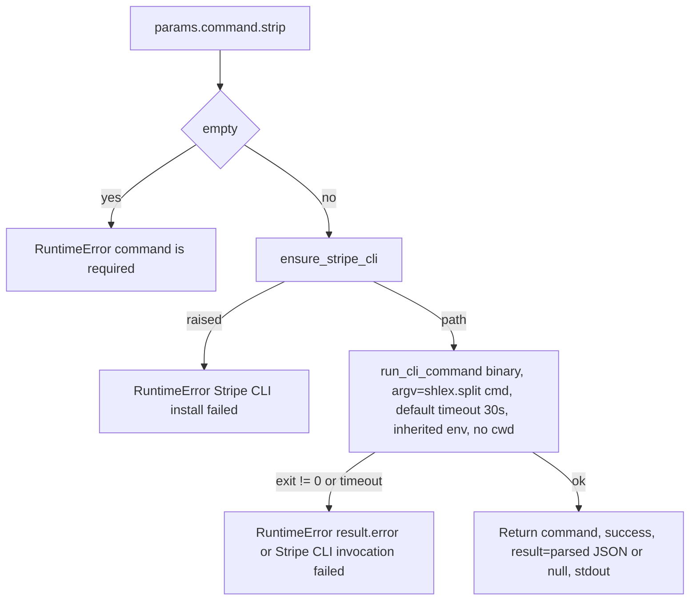

# Stripe (`stripeAction`)

| Field | Value |
|------|-------|
| **Category** | payments (class `group = ("payments", "tool")`) |
| **Backend handler** | [`server/nodes/stripe/stripe_action.py`](../../../server/nodes/stripe/stripe_action.py) (`StripeActionNode`, on `ActionNode`); installer [`_install.py`](../../../server/nodes/stripe/_install.py); credential [`_credentials.py`](../../../server/nodes/stripe/_credentials.py) |
| **Tests** | [`server/tests/nodes/test_stripe_plugin.py`](../../../server/tests/nodes/test_stripe_plugin.py) |
| **Skill (if any)** | [`server/skills/payments_agent/stripe-skill/SKILL.md`](../../../server/skills/payments_agent/stripe-skill/SKILL.md) (`allowed-tools: "stripe_action"`) |
| **Dual-purpose tool** | yes - tool name `stripe_action` |

## Purpose

Run one Stripe CLI command exactly as it would be typed after `stripe ` and
return the CLI's JSON response. There are no per-resource operations: the
CLI does its own argument parsing, validation and error reporting, so every
Stripe resource (customers, charges, payment_intents, refunds, invoices,
subscriptions, `trigger <event>` and the rest) works through the single
`command` string. Authentication is the CLI's own `stripe login` state.

## Inputs (handles)

| Handle | Connection type | Required | Purpose |
|--------|-----------------|----------|---------|
| `input-main` | main | no | Declared, but `hideInputHandle` is auto-set (`usable_as_tool = True`, class does not declare `hide_input_handle`) |

## Parameters

`extra="ignore"` on the model.

| Name | Type | Default | Required | displayOptions.show | Description |
|------|------|---------|----------|---------------------|-------------|
| `command` | string | `""` | yes (checked at runtime) | - | The Stripe CLI command after `stripe `, split with `shlex.split` |

## Outputs (handles)

| Handle | Shape | Description |
|--------|-------|-------------|
| `output-main` | object | `StripeActionOutput`; `hideOutputHandle` auto-set |
| `output-tool` | - | Auto-appended for `usable_as_tool` |

### Output payload (TypeScript shape)

`extra="allow"`. The operation returns a dict, so `_serialize_result`
validates it against the model and dumps with `exclude_unset`.

```ts
{
  command: string;          // the trimmed command that ran
  success: true;
  result: unknown | null;   // json.loads(stdout), or null when stdout is not JSON
  stdout: string;           // raw stdout, ALWAYS present alongside result (unlike the _shape convention of the other CLI nodes)
  error?: string;           // declared on the model but never populated by the operation
}
```

## Logic Flow



## Decision Logic

- **Validation**: blank `command` raises `RuntimeError`, NOT
  `NodeUserError`. All three failure paths in this node raise
  `RuntimeError`, so `BaseNode.execute` treats them as unexpected bugs:
  `logger.exception` with a full traceback and a generic error envelope
  rather than the one-line WARN contract the other CLI nodes use.
- **Binary resolution** (`ensure_stripe_cli`): in-process cache, then
  `shutil.which("stripe")` (a system install is preferred), then a
  previously downloaded copy at `<DATA_DIR>/packages/stripe/bin/stripe(.exe)`,
  then a download of the pinned `1.40.9` release from GitHub releases
  (`httpx`, 120 s, member extracted from the zip / tar.gz, `chmod +x` on
  POSIX) under an install lock.
- **No credential injection**: `run_cli_command` is called without
  `credential=`, so no `--api-key` is appended. The CLI reads its own
  `config.toml` (`$XDG_CONFIG_HOME/stripe/` or `~/.config/stripe/`).
- **Timeout**: the `run_cli_command` default of 30 s - the node passes none.
  On timeout the process tree is killed and the error is
  `"<binary> timed out (30.0s)"`.
- **Result parsing**: `run_cli_command` runs `json.loads` on the whole
  stdout; non-JSON output leaves `result` as `null` with the text in
  `stdout`.

## Side Effects

- **Subprocess**: one `stripe` process per execution, inheriting the
  server's environment and cwd (no `env`, no `cwd` override, so ambient
  Stripe CLI env vars apply per the CLI's own rules).
- **Install**: first use may download ~12 MB from
  `github.com/stripe/stripe-cli/releases` into
  `<DATA_DIR>/packages/stripe/bin/`.
- **External API calls**: whatever the Stripe CLI performs for the command;
  `trigger <event>` causes Stripe to deliver a synthetic webhook to the
  `stripe listen` daemon (see [`stripeReceive`](./stripeReceive.md)).
- **Cost metadata**: `cost={"service": "stripe", "action": "run", "count": 1}`.
- **Broadcasts / DB writes**: none beyond the standard node status.

## External Dependencies

- **Credentials**: `StripeCredential` (`id = "stripe"`, `auth = "custom"`).
  `resolve()` returns only `{"stripe_webhook_secret": ...}` when the listen
  daemon has captured one; the action node never reads it. Login state is
  the CLI's `config.toml`, written by the `stripe_login` WS handler
  (`stripe login --non-interactive` then `--complete <url>`); the modal badge
  is the synthetic `cli-managed` marker OAuth row.
- **Services**: Stripe API via the CLI; GitHub releases for the install.
- **Python packages**: `httpx` (installer), `pydantic`;
  `services.events.run_cli_command`.
- **Environment variables**: `XDG_CONFIG_HOME` (CLI config location);
  anything the Stripe CLI itself honours.

## Edge cases & known limits

- No `ui_hints`: unlike the other CLI nodes there is no
  `outputMode: "terminal"`, so text `stdout` renders through the markdown
  path in the output panel.
- `stdout` always ships next to `result`, duplicating the JSON as a string.
- Long-running commands (large `list --limit`, slow network) hit the 30 s
  default and are reported as a generic failure.
- `annotations = {"destructive": False, ...}` although refunds, deletes and
  `trigger` mutate account state.
- `shlex.split` is POSIX-mode: Windows paths and unbalanced quotes inside
  `command` raise `ValueError` (generic branch).
- One Stripe account per install (single CLI config file).

## Related

- **Skills using this as a tool**: [stripe-skill](../../../server/skills/payments_agent/stripe-skill/SKILL.md)
- **Sibling**: [`stripeReceive`](./stripeReceive.md) - the webhook trigger the skill pairs it with
- **Architecture docs**: [Stripe Service](../../stripe_service.md), [Plugin System](../../plugin_system.md)
