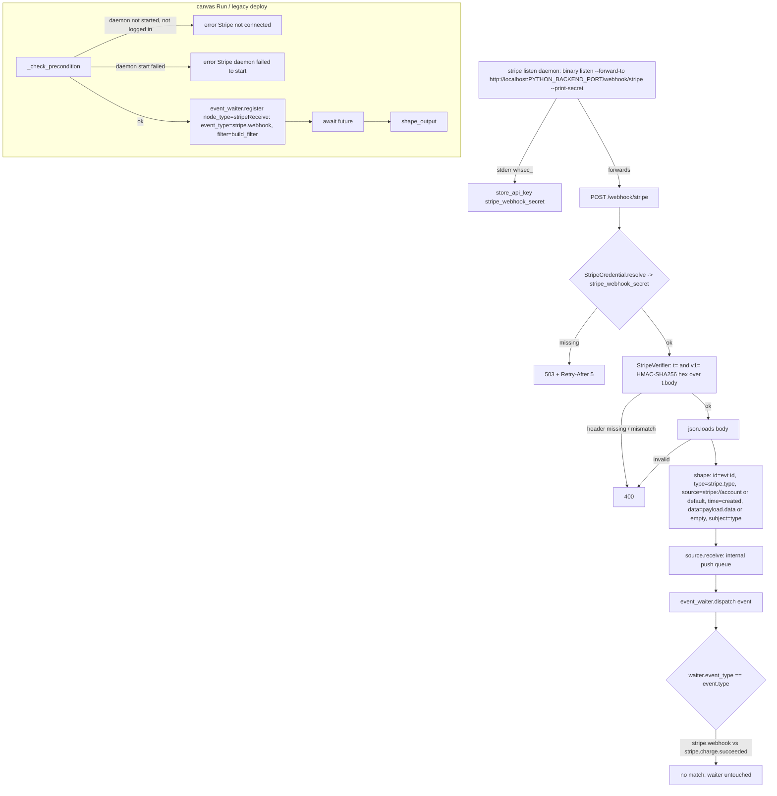

# Stripe Receive (`stripeReceive`)

| Field | Value |
|------|-------|
| **Category** | payments / trigger (class `group = ("payments", "trigger")`) |
| **Backend handler** | [`server/nodes/stripe/stripe_receive.py`](../../../server/nodes/stripe/stripe_receive.py) (`StripeReceiveNode`, on `WebhookTriggerNode`); daemon + webhook plumbing in [`_source.py`](../../../server/nodes/stripe/_source.py) (`StripeListenSource`, `StripeWebhookSource`); framework base [`services/events/triggers.py`](../../../server/services/events/triggers.py), [`services/events/webhook.py`](../../../server/services/events/webhook.py), verifier [`services/events/verifiers/stripe.py`](../../../server/services/events/verifiers/stripe.py) |
| **Tests** | [`server/tests/nodes/test_stripe_plugin.py`](../../../server/tests/nodes/test_stripe_plugin.py) |
| **Skill (if any)** | none as a tool (the [stripe-skill](../../../server/skills/payments_agent/stripe-skill/SKILL.md) teaches it in prose; its `allowed-tools` names only `stripe_action`) |
| **Dual-purpose tool** | no (trigger) |

## Purpose

Fire a workflow when Stripe delivers a webhook event. A supervised
`stripe listen` daemon forwards every event for the logged-in account to
`POST /webhook/stripe`; the source verifies the `Stripe-Signature` header
against the `whsec_` secret captured from the daemon's own stderr, shapes the
payload into a `WorkflowEvent` of type `stripe.<event type>`, and hands it to
the in-process event waiter. The node contributes the event-type glob, a
livemode filter, a precondition that starts the daemon on demand, and the
output reshape.

## Inputs (handles)

None - this is a trigger; it is the head of a run.

## Parameters

`StripeReceiveParams(BaseTriggerParams)`, `extra="ignore"`.

| Name | Type | Default | Required | displayOptions.show | Description |
|------|------|---------|----------|---------------------|-------------|
| `event_type_filter` | string | `all` | no | - | `all`, an exact Stripe type, or a `prefix.*` glob. `build_filter` prepends `stripe.` unless the value already starts with it, so users write `charge.*` |
| `livemode_filter` | `all \| test \| live` | `all` | no | - | Extra filter read from `event.data.livemode` (see Decision Logic for why this does not work end-to-end) |

## Outputs (handles)

| Handle | Shape | Description |
|--------|-------|-------------|
| `output-main` | object | `StripeReceiveOutput` (the shaped dict from `shape_output`) |

### Output payload (TypeScript shape)

`extra="allow"`. All fields are `Optional` on the model.

```ts
{
  event_id: string;             // WorkflowEvent.id = Stripe evt_... id (empty string when the payload had none)
  event_type: string;           // WorkflowEvent.type with the "stripe." prefix stripped, e.g. "charge.succeeded"
  created: number | null;       // read from event.data - null in practice (see below)
  livemode: boolean | null;     // read from event.data - null in practice
  api_version: string | null;   // read from event.data - null in practice
  request_id: string | null;    // event.data.request.id or event.data.request - null in practice
  account: string | null;       // event.data.account, else the host part of WorkflowEvent.source ("acct_..." or "default")
  data: object;                 // event.data.data when that is a dict, else event.data itself (= Stripe's data object {object, previous_attributes?})
}
```

## Logic Flow



## Decision Logic

- **Precondition** (`_check_precondition`, canvas Run only): if the listen
  source is not `_started`, `has_credential()` (a filesystem sniff for
  `_api_key` in the CLI's `config.toml`) must be true, else the run returns
  the error "Stripe not connected. Add Stripe API key in Credentials and
  connect." Then `source.start()` runs: `ensure_stripe_cli()`, the
  `DaemonEventSource` credential gate, and `ProcessService.start(name=
  "stripe-listen", workflow_id="_stripe", working_directory=daemons_dir())`.
  A failed start returns "Stripe daemon failed to start: <error>". Deploying
  a Stripe workflow is the demand signal for the daemon; the status refresh
  never starts it.
- **Signature verification fails closed**: no captured secret -> HTTP 503
  with `Retry-After: 5`; missing header, missing `t=` / `v1=`, or no
  matching `v1=` candidate -> HTTP 400. Multiple `v1=` values are accepted
  (rotation).
- **Filter** (`build_filter`): `event_type_filter` is normalised to
  `stripe.<value>` and matched with `WorkflowEvent.matches_type` (exact, or
  `prefix.*`; `all` / empty matches everything). `_extra_filter` returns
  `None` for `livemode_filter=all`, otherwise a predicate comparing
  `bool(event.data.get("livemode"))` with the target.
- **Event-key mismatch (load-bearing)**: `StripeReceiveNode.event_type` is
  derived by `WebhookTriggerNode.__init_subclass__` from
  `StripeWebhookSource.type = "stripe.webhook"`, and that is the key
  `event_waiter.register` stores on the waiter. `WebhookSource.handle`
  dispatches the envelope, whose `type` is `stripe.<stripe type>`, and
  `event_waiter.dispatch` selects waiters by exact equality
  `w.event_type == event_type`. As written, a real delivery therefore never
  resolves a `stripeReceive` waiter on either path. The node is NOT
  registered with `register_canary_trigger_type` (no call in
  `nodes/stripe/`), so deployment rides the legacy
  `TriggerManager.setup_event_trigger` collector, which registers through
  the same `event_waiter.register` and inherits the same key.
- **Data-shape mismatch**: `StripeWebhookSource.shape` stores only
  `payload["data"]` (Stripe's `{object, previous_attributes?}`) in
  `WorkflowEvent.data`, but `shape_output` and the livemode predicate read
  `created`, `livemode`, `api_version`, `request` and `account` from that
  same `event.data`. Those are top-level Stripe event fields, so they resolve
  to `None`; `livemode_filter=live` rejects every event and
  `livemode_filter=test` accepts every event; the output `data` falls
  through to `event.data` itself. The unit tests exercise `shape` and
  `shape_output` with different envelope shapes, so each passes in isolation.
- **Fallbacks**: `created` missing or non-integer -> `time = now(UTC)`;
  `account` missing -> `source = "stripe://default"`; missing `id` -> empty
  string; missing `type` -> `stripe.unknown`.

## Side Effects

- **Subprocess**: the `stripe listen` daemon (`StripeListenSource`,
  `process_name = "stripe-listen"`, `workflow_namespace = "_stripe"`, cwd
  `<DATA_DIR>/daemons/`), supervised by `ProcessService`, which logs its
  stdout / stderr and broadcasts them to the Terminal tab. `--forward-to`
  uses `Settings().port` (`PYTHON_BACKEND_PORT`).
- **Database writes**: `auth_service.store_api_key("stripe_webhook_secret",
  <whsec_...>, models=[])` whenever a `whsec_` token appears on the daemon's
  stderr (fire-and-forget task).
- **Broadcasts**: `update_node_status(..., "waiting", {"event_type":
  "stripe.webhook", "waiter_id": ...})` from the trigger manager / executor;
  `make_status_refresh` mirrors `source.status()` plus login state into
  `broadcaster._status["stripe"]` under broadcast type `stripe_status`.
- **HTTP**: `POST /webhook/stripe` answered by the router after
  `handle()`; the source's `receive()` also enqueues the event on its
  internal push queue (nothing consumes that queue for this source).
- **WS handlers**: `stripe_connect` / `stripe_disconnect` /
  `stripe_reconnect` / `stripe_status` (lifecycle factory, `stripe_status`
  overridden to add `logged_in` / `connected`), `stripe_login`,
  `stripe_logout`, `stripe_trigger`.

## External Dependencies

- **Credentials**: `StripeCredential` (`id = "stripe"`, `auth = "custom"`) -
  `resolve()` exposes only `stripe_webhook_secret`; login state is the CLI's
  own `config.toml` (`$XDG_CONFIG_HOME/stripe/` or `~/.config/stripe/`).
- **Services**: the Stripe CLI (system PATH preferred, else pinned `1.40.9`
  download into `<DATA_DIR>/packages/stripe/bin/`); Stripe's webhook
  delivery through `stripe listen`.
- **Python packages**: `pydantic`, stdlib `hmac` / `hashlib`, `fastapi`.
- **Environment variables**: `PYTHON_BACKEND_PORT` (via `Settings().port`),
  `XDG_CONFIG_HOME`.

## Edge cases & known limits

- `TRIGGER_START_TO_CLOSE` (24 h) bounds the Temporal activity for a
  canvas Run; there is no shorter wait timeout.
- Event ids mirror Stripe's `evt_` ids, so retried deliveries carry the same
  `WorkflowEvent.id`; no dedup is performed in this plugin.
- Secret race: events forwarded before the `whsec_` line is captured get a
  503 and are retried by Stripe / the CLI.
- One account per install; the daemon is a single global process.
- No auto-restart on daemon crash - status shows disconnected until the user
  reconnects.
- The `stripe_service.md` request-flow diagram documents `data=payload`
  (the full event); the code stores `payload["data"]`.

## Related

- **Sibling**: [`stripeAction`](./stripeAction.md) (`trigger <event>` is the easiest way to exercise this node)
- **Architecture docs**: [Stripe Service](../../stripe_service.md), [Event Waiter System](../../event_waiter_system.md), [Event Framework](../../event_framework.md)
