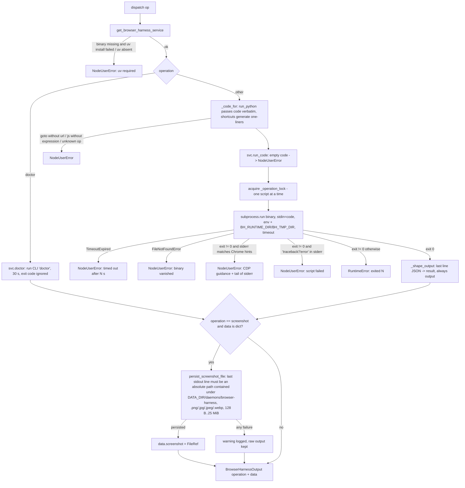

# Browser Harness (`browserHarness`)

| Field | Value |
|------|-------|
| **Category** | browser / tool (palette group `browser`; sibling of the stable `browser` node, not a replacement) |
| **Backend handler** | [`server/nodes/browser/browser_harness/__init__.py::BrowserHarnessNode.dispatch`](../../../server/nodes/browser/browser_harness/__init__.py) (dispatch via `BaseNode.execute()` + `@Operation("dispatch")`; plugin folder: [`_service.py`](../../../server/nodes/browser/browser_harness/_service.py) subprocess wrapper + daemon shutdown hook, [`_install.py`](../../../server/nodes/browser/browser_harness/_install.py) uv-tool installer; screenshot persistence shared with `browser` in [`nodes/browser/_screenshots.py`](../../../server/nodes/browser/_screenshots.py)) |
| **Tests** | [`server/tests/nodes/test_browser_harness.py`](../../../server/tests/nodes/test_browser_harness.py) (`TestBrowserHarnessNode`, `TestBrowserHarnessService`) |
| **Skill (if any)** | [`server/skills/web_agent/browser-harness-skill/SKILL.md`](../../../server/skills/web_agent/browser-harness-skill/SKILL.md) (`allowed-tools: browserHarness`) |
| **Dual-purpose tool** | yes - tool name `browser_harness` (`usable_as_tool = True`) |

## Purpose

Drives the user's **real, logged-in Chrome** over raw CDP through the
`browser-harness` CLI (browser-use/browser-harness, PyPI, alpha). The
upstream driving model is "the LLM writes Python against ~25 pre-imported
helpers", so the primary operation is `run_python`: the snippet is piped
verbatim to the CLI's stdin and executed against helpers such as
`goto_url`, `click_at_xy`, `capture_screenshot`, `js`, `fill_input`,
`wait_for_load`, `list_tabs`, `page_info`. The other operations are
one-helper shortcuts generated as Python text, plus `doctor`, which runs the
CLI's own Chrome/CDP diagnosis. Reach for it when a task needs the user's
own profile/session state, canvas- or shadow-DOM-heavy or bot-hostile
sites, or raw CDP; default to the accessibility-tree `browser` node
otherwise.

## Inputs (handles)

| Handle | Connection type | Required | Purpose |
|--------|-----------------|----------|---------|
| `input-main` | main | no | Upstream data for template substitution into `code` / `url` / `expression` |
| `output-tool` (source, synthesized) | tools | no | The class declares only `input-main` + `output-main`; because `usable_as_tool = True` and neither `hide_input_handle` nor `hide_output_handle` is declared, `BaseNode.__init_subclass__` flags both canvas handles hidden and `_metadata_dict` appends an `output-tool` handle to the NodeSpec so the node can be wired to an agent's `input-tools` |

## Parameters

Params model `BrowserHarnessParams` (`extra="ignore"`):

| Name | Type | Default | Required | displayOptions.show | Description |
|------|------|---------|----------|---------------------|-------------|
| `operation` | enum `run_python` \| `goto` \| `screenshot` \| `js` \| `tabs` \| `doctor` | `run_python` | no | - | `run_python` executes a snippet against the harness helpers; the rest are single-helper shortcuts; `doctor` diagnoses the Chrome/CDP connection |
| `code` | string (code editor, 8 rows) | `""` | no (but an empty snippet raises `NodeUserError` in `run_code`) | `operation: [run_python]` | Python for `run_python`. Helpers are pre-imported. Print a JSON object as the final line for structured output |
| `url` | string | `""` | no (required by `goto`, enforced in `_code_for`) | `operation: [goto]` | URL to open |
| `expression` | string (4 rows) | `""` | no (required by `js`, enforced in `_code_for`) | `operation: [js]` | JavaScript to evaluate in the page |
| `full_page` | boolean | `false` | no | `operation: [screenshot]` | Capture the full scrollable page |
| `timeout` | integer, `ge=5, le=600` | `60` | no | - | Script timeout in seconds (applies to every operation except `doctor`, which is fixed at 30 s) |

Generated Python per shortcut (`_code_for`; user strings are embedded with
`repr()` so quotes/backslashes cannot break out of the generated source):

| Operation | Generated snippet |
|-----------|-------------------|
| `goto` | `goto_url(<url!r>)` / `wait_for_load()` / `print(page_info())` |
| `screenshot` | `p = capture_screenshot(full=<bool>)` / `print(p)` |
| `js` | `print(js(<expression!r>))` |
| `tabs` | `print(list_tabs())` |

## Outputs (handles)

| Handle | Shape | Description |
|--------|-------|-------------|
| `output-main` | object | `BrowserHarnessOutput` (`extra="allow"`) wrapped in the standard `{success, result, execution_time}` envelope; as a tool the envelope is unwrapped to the flat object |

### Output payload (TypeScript shape)

```ts
{
  operation: 'run_python' | 'goto' | 'screenshot' | 'js' | 'tabs' | 'doctor';
  data: {
    output: string;          // full stdout (stderr when stdout was empty, e.g. doctor); capped at 100_000 chars + "...(truncated)"
    result?: unknown;        // present only when the LAST non-empty stdout line parses as JSON
    screenshot?: FileRef;    // screenshot op only: serialized workspace FileRef (kind "image") when the printed path was persisted
  };
}
```

`doctor` always returns `{ output: string }` — exit code 1 is a report, not
an error.

## Logic Flow



## Decision Logic

- **Validation**: `get_browser_harness_service()` returns `None` when `uv` is not on PATH or `uv tool install` fails (one `NodeUserError`); `goto` without `url` and `js` without `expression` raise `NodeUserError` before any subprocess; empty `code` raises inside `run_code`; an unknown `operation` (unreachable through the Literal) raises `NodeUserError`.
- **Branches**: `doctor` bypasses `_code_for` entirely and calls the CLI with a `doctor` argv and no stdin, `check=False`; every other operation is a stdin script. The screenshot FileRef branch runs only when `data` is a dict with at least one non-empty output line — the printed path is treated as untrusted process output and must resolve under the harness runtime dir.
- **Fallbacks**: `_run_sync` returns stderr when stdout is empty (diagnostic verbs write to stderr); `_shape_output` falls back to `{output}` when the last line is not JSON.
- **Error paths**: stderr containing any of `devtoolsactiveport`, `unreachable`, `is the dedicated automation chrome running`, `chrome://inspect`, `no browser connection`, `connection refused` maps to the CDP guidance `NodeUserError`; stderr containing `traceback` or `error` maps to "script failed" (`NodeUserError`); anything else is a `RuntimeError` (full traceback in the operator log). Cancellation of the awaiting task does **not** release `_operation_lock` until the subprocess finishes (`_to_thread_until_complete`), so a cancelled script cannot overlap the next one on the single daemon/CDP socket.

## Side Effects

- **Database writes**: none from the node (no `cost=` on the operation, no usage tracking). A persisted screenshot writes a file only, no row.
- **Broadcasts**: none beyond the generic `node_status` updates `BaseNode.execute()` emits.
- **External API calls**: none directly; the CLI talks to Chrome over CDP.
- **File I/O**: first use installs into `<DATA_DIR>/packages/browser-harness/tools/` (uv tool venv) and `.../bin/browser-harness[.exe]`; every spawn creates `<DATA_DIR>/daemons/browser-harness/` and `.../tmp/` and pins `BH_RUNTIME_DIR` / `BH_TMP_DIR` there (daemon pid/port/sock, screenshots, daemon log never land in `~/.config/browser-harness`); `screenshot` copies the bytes into the run's workspace media subdir via `write_media(kind="image")` (no workspace on the run -> warning, not persisted).
- **Subprocess**: `uv tool install --python 3.12 --upgrade browser-harness` (install), then one `browser-harness` CLI process per operation; the CLI auto-starts a detached daemon that holds the single CDP WebSocket and outlives the CLI. The `browser_harness` shutdown hook (`register_shutdown_hook`) reads `<BH_RUNTIME_DIR>/bu.pid` and `kill_tree`s it on FastAPI lifespan shutdown; missing/stale pid files are ignored.

## External Dependencies

- **Credentials**: none.
- **Services**: `services.plugin.shutdown_hooks`, `services._supervisor.util.kill_tree`, `services.media.workspace.write_media` (through `_screenshots.py`), `core.paths.package_dir` / `daemons_dir`.
- **Python packages**: `uv` on PATH (install-time only); `browser-harness` (PyPI, alpha; Python 3.12 pinned by the installer).
- **Environment variables**: sets `BH_RUNTIME_DIR`, `BH_TMP_DIR` on every spawn and `UV_TOOL_DIR` / `UV_TOOL_BIN_DIR` during install; passes `BU_CDP_URL` / `BU_CDP_WS` through untouched (operator override for a dedicated automation Chrome). Chrome must be CDP-reachable: `BU_CDP_URL`/`BU_CDP_WS`, chrome://inspect remote debugging, or a Chrome started with `--remote-debugging-port` (the guidance text names port 9222 because that is the CLI's own probe default, not an OpenCompany port).
- **Task queue**: `TaskQueue.BROWSER`. Annotations: `destructive`, `open_world`.

## Edge cases & known limits

- `run_python` executes agent-authored Python **outside** any sandbox with the user's real browser attached; annotations say `destructive + open_world` for that reason.
- One script at a time per backend process (`asyncio.Lock`); parallel tool calls serialize, so a 600 s script blocks every other harness call.
- `timeout` is ignored by `doctor` (fixed 30 s).
- Output is capped at 100,000 characters; a snippet that prints large page text loses its trailing JSON line and `result` is then absent.
- The structured `result` depends purely on the LAST non-empty stdout line parsing as JSON — an extra trailing `print` from the snippet silently demotes the result to `output`.
- The stderr classification is heuristic: any non-zero exit whose stderr contains the substring `error` becomes a one-WARN-line `NodeUserError` even when the cause is a genuine harness bug.
- The daemon's own Chrome discovery, IPC (AF_UNIX on POSIX, token-auth TCP loopback on Windows) and screenshot format are upstream behaviour; `full_page` is passed as `capture_screenshot(full=...)` and nothing else about the image is controlled here.
- `screenshot` persists only when the harness printed an absolute path under `<DATA_DIR>/daemons/browser-harness`; a path anywhere else is refused (warning), so a harness build that writes elsewhere yields no `FileRef`.
- Upgrades are not automatic once the binary exists: `browser_harness_binary_path` returns the existing binary without re-running `uv tool install --upgrade`.

## Related

- **Skills using this as a tool**: [`browser-harness-skill`](../../../server/skills/web_agent/browser-harness-skill/SKILL.md) (see -> act -> verify loop, helper reference, print-JSON-last convention).
- **Other nodes that consume this output**: [`canvas`](../ai_tools/canvas.md) displays the persisted `data.screenshot` FileRef; [`browser`](./browser.md) is the stable sibling.
- **Architecture docs**: [browser_harness.md](../../browser_harness.md), [media_transport.md](../../media_transport.md), [plugin_system.md](../../plugin_system.md).
