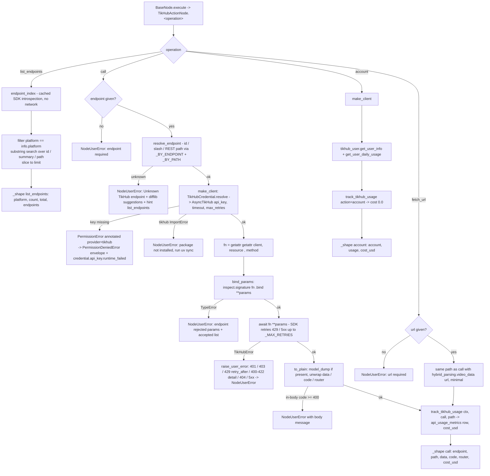

# TikHub (`tikhubAction`)

| Field | Value |
|------|-------|
| **Category** | web_automation / scraper / tool (dual-purpose) |
| **Backend handler** | [`server/nodes/scraper/tikhub_action/__init__.py::TikHubActionNode`](../../../server/nodes/scraper/tikhub_action/__init__.py) - dispatch via `BaseNode.execute()` -> `@Operation("call" / "list_endpoints" / "fetch_url" / "account")`; SDK glue in [`_sdk.py`](../../../server/nodes/scraper/tikhub_action/_sdk.py) |
| **Tests** | [`server/tests/nodes/test_tikhub.py`](../../../server/tests/nodes/test_tikhub.py) |
| **Skill (if any)** | [`server/skills/web_agent/tikhub-skill/SKILL.md`](../../../server/skills/web_agent/tikhub-skill/SKILL.md) |
| **Dual-purpose tool** | yes - tool name `tikhub_action` (`usable_as_tool = True`; both canvas handles explicitly kept visible) |

## Purpose

Call any endpoint of the TikHub social-scraping API (TikTok, Douyin,
Instagram, YouTube, Twitter/X, Xiaohongshu, Bilibili, Kuaishou, Weibo,
Reddit, Threads, LinkedIn, Zhihu, ...) through the official `tikhub`
Python SDK. The node is a "flattened CLI": instead of one operation per
endpoint it exposes `call`, addressed by the SDK's own `resource.method`
id (e.g. `douyin_web.fetch_one_video`), plus `list_endpoints` to discover
ids and their typed parameters without spending a request, `fetch_url`
for the share-URL hybrid parser, and `account` for balance / daily usage.
Used both as a workflow node and as an AI-agent tool; the agent runs the
discover-then-call loop documented in the skill.

## Inputs (handles)

| Handle | Connection type | Required | Purpose |
|--------|-----------------|----------|---------|
| `input-main` | main | no | Upstream data; not consumed directly - all inputs come from `parameters` (or the LLM's tool args when used as a tool) |

## Parameters

(Pydantic `TikHubActionParams`, `model_config = {"extra": "ignore"}`; a
`@model_validator(mode="before")` runs `coerce_blank_params(...,
object_fields=("params",))` so the panel's `""` and LLM-stringified JSON
both become a dict.)

| Name | Type | Default | Required | displayOptions.show | Description |
|------|------|---------|----------|---------------------|-------------|
| `operation` | options | `call` | no | - | `call` / `list_endpoints` / `fetch_url` / `account` |
| `platform` | options (`PLATFORMS` Literal) | `all` | no | `operation` in [`call`, `list_endpoints`] | Drives the endpoint dropdown and the listing filter (`all`, `tiktok`, `douyin`, `instagram`, `youtube`, `twitter`, `xiaohongshu`, `bilibili`, `kuaishou`, `weibo`, `reddit`, `threads`, `linkedin`, `zhihu`, `toutiao`, `xigua`, `wechat`, `lemon8`, `pipixia`, `hybrid`, `tikhub`) |
| `endpoint` | string (dynamic options: `loadOptionsMethod: "tikhubEndpoints"`, depends on `platform`) | `""` | yes for `call` | `operation` = `call` | `resource.method` id, `resource/method`, or a `/api/v1/...` path. Plain `str` (not a Literal) so the LLM can pass any id |
| `params` | object (JSON editor) | `{}` | no | `operation` = `call` | SDK keyword arguments for the endpoint; POST batch endpoints take `{"body": [...]}` |
| `search` | string | `""` | no | `operation` = `list_endpoints` | Substring filter over endpoint id / summary / path |
| `limit` | int (`ge=1, le=2000`) | `100` | no | `operation` = `list_endpoints` | Max endpoints returned |
| `url` | string | `""` | yes for `fetch_url` | `operation` = `fetch_url` | Share URL (TikTok / Douyin, incl. short links) |
| `minimal` | boolean | `false` | no | `operation` = `fetch_url` | Forwarded as `hybrid_parsing.video_data(minimal=...)` |

Field names `model`, `api_key`, `parameters` and `action` are deliberately
avoided (name-based magic in `ParameterRenderer.tsx`).

## Outputs (handles)

| Handle | Shape | Description |
|--------|-------|-------------|
| `output-main` | object | `_shape(operation, **fields)` payload (see below); the same payload is returned to the LLM when wired to `input-tools` |

### Output payload

`TikHubActionOutput` (`extra="allow"`, every field Optional; `_shape`
drops `None` values but keeps `{}` / `[]` - an empty answer from TikHub is
real data):

```ts
// operation = "call" | "fetch_url"
{
  operation: 'call' | 'fetch_url';
  endpoint: string;          // resolved resource.method id
  path: string | null;       // REST path from the SDK docstring (null if not introspectable)
  url?: string;              // fetch_url only
  data: unknown;             // TikHub's `data` field, platform-specific shape
  code: number;              // TikHub envelope code (200 on success)
  router: string;            // TikHub envelope router
  cost_usd: number;          // what track_tikhub_usage recorded (0.001 flat)
}

// operation = "list_endpoints"
{
  operation: 'list_endpoints';
  platform: string;
  count: number;             // after search + limit
  total: number;             // endpoints on that platform
  endpoints: Array<{
    endpoint: string; resource: string; method: string;
    http_method: string | null; path: string | null; summary: string;
    params: Array<{ name: string; type: string; required: boolean }>;
  }>;
}

// operation = "account"
{
  operation: 'account';
  account: unknown;          // tikhub_user.get_user_info() data
  usage: unknown;            // tikhub_user.get_user_daily_usage() data
  cost_usd: number;          // 0.0
}
```

Wrapped by `BaseNode._serialize_result` in the standard envelope
`{ success: true, result: <payload>, ... }`. Runtime output schema
registered via `register_output_schema("tikhubAction", ...)`.

## Logic Flow



## Decision Logic

- **Validation**: `call` requires `endpoint`; `fetch_url` requires `url`.
  `limit` is bounded `1..2000` by Pydantic. `params` must be an object
  (blank / JSON-string inputs are coerced first).
- **Endpoint resolution** accepts three spellings (`resource.method`,
  `resource/method`, `/api/v1/...` path or URL containing it) and fails
  before any network call with up to five close matches.
- **Parameter binding** happens against the live SDK signature before
  the request; unknown or missing-required kwargs raise with the accepted
  parameter list.
- **Platform filter** in `list_endpoints` is `info.platform == platform`
  (first underscore segment of the resource name); `all` disables the
  filter. `search` is a case-insensitive substring over id, summary and
  path.
- **Dropdown loader** (`load_tikhub_endpoints`) returns `[]` for
  `platform == "all"` (the UI prompts to pick a platform) and `[]` with a
  WARN log when the SDK cannot be imported - discovery never breaks the
  parameter panel.
- **Error paths**: pre-flight (`Unknown TikHub endpoint`, `rejected
  params`), credential (`PermissionDeniedError` envelope), SDK
  `TikHubError` subclasses mapped to `NodeUserError` messages (401 key
  rejected -> Credentials; 403 scope-or-balance -> run `account`; 429
  with `retry_after`; 400/422 with TikHub `detail` and ~500 chars of body;
  404 route gone; 5xx / connection -> upstream after retries;
  `FeatureRemoved` / `Config` -> `str(e)`), in-body `code >= 400` ->
  `NodeUserError`. Anything else propagates with a traceback.
- **Fallbacks**: `path` is `None` when neither the docstring nor the
  source carries the route literal (endpoint still callable by id).

## Side Effects

- **Database writes**: one `api_usage_metrics` row per successful `call` /
  `fetch_url` (`service="tikhub"`, `operation` from `operation_map`,
  `endpoint=<REST path>`, `resource_count=1`, `cost=0.001`) and per
  `account` (`cost=0.0`); none for `list_endpoints`; none after a 4xx /
  5xx. Written by `track_tikhub_usage` in a `try/except` - a metrics
  failure logs a WARN and never fails the call.
- **Broadcasts**: per-node status via `BaseNode.execute`
  (`update_node_status` executing / success / error); the credential
  path emits `credential.api_key.runtime_failed` when the key is missing.
  No plugin-specific broadcasts.
- **External API calls**: `GET|POST https://api.tikhub.io/api/v1/<platform>/<api>/<action>`
  with `Authorization: Bearer <key>` via the SDK's internal httpx client;
  `fetch_url` -> `GET /api/v1/hybrid/video_data`; `account` ->
  `GET /api/v1/tikhub/user/get_user_info` +
  `GET /api/v1/tikhub/user/get_user_daily_usage`. `list_endpoints` makes
  no call.
- **File I/O**: none.
- **Subprocess**: none.

## External Dependencies

- **Credentials**: `TikHubCredential` (`ApiKeyCredential`, id `tikhub`,
  bearer `Authorization`) resolved via `TikHubCredential.resolve(user_id=ctx.credential_customer_id)`;
  stored in `EncryptedAPIKey`. Modal probe: `GET /api/v1/tikhub/user/get_user_info`.
- **Services**: `PricingService` (`api.tikhub` + `operation_map.tikhub`
  in `pricing.json`), `Database.save_api_usage_metric`, option-loader
  registry (`tikhubEndpoints`).
- **Python packages**: `tikhub>=2.1.2,<3` (imported lazily inside `_sdk.py`
  functions only; brings `httpx`, `pydantic`, `anyio`, `typer`,
  `shellingham`).
- **Environment variables**: none. `TIKHUB_API_KEY` in the process
  environment is deliberately ignored - the key is always passed
  explicitly.

## Edge cases & known limits

- **First use pays introspection**: `endpoint_index()` reflects ~1,100
  SDK methods (~100-300 ms) once per process, behind an `asyncio.Lock`.
- **`platform: all` yields no dropdown options** by design; the LLM path
  is unaffected because `endpoint` is free text.
- **Flat pricing is a floor**: TikHub prices some endpoints above
  `$0.001`; `cost_usd` records the flat rate, `account` reports the true
  balance.
- **403 is ambiguous** (plan scope vs exhausted balance) - the message
  defers to `account`.
- **In-body errors**: TikHub can answer HTTP 200 with `code: 400` in the
  JSON; the SDK does not raise on it, `to_plain` does.
- **Non-idempotent retries**: the SDK retries 429 / 5xx itself
  (`_MAX_RETRIES`, default 2); mapped errors are `NodeUserError` so
  Temporal does not re-run a paid call on top of that.
- **Pagination is caller-driven**: cursor names differ per platform
  (`max_cursor`, `cursor`, `pagination_token`, `continuation_token`,
  `after`, `lastCursor`, `pcursor`); the node passes whatever `params`
  carries and never loops.
- **SDK drift**: resources regenerate between SDK minors; `PLATFORMS`
  and the skill's cited ids are guarded by contract tests 12 and 18
  (see [TikHub Service](../../tikhub_service.md) for the bump recipe).
- **Batch POST endpoints** take `params: {"body": [...]}`; there is no
  separate body field.

## Related

- **Skills using this as a tool**: [`tikhub-skill/SKILL.md`](../../../server/skills/web_agent/tikhub-skill/SKILL.md)
- **Companion nodes**: [`apifyActor`](./apifyActor.md) (actor-based scraping with datasets), [`browser`](./browser.md), [`crawleeScraper`](./crawleeScraper.md)
- **Architecture docs**: [TikHub Service](../../tikhub_service.md), [Plugin System](../../plugin_system.md), [Pricing Service](../../pricing_service.md), [Credentials Encryption](../../credentials_encryption.md)
